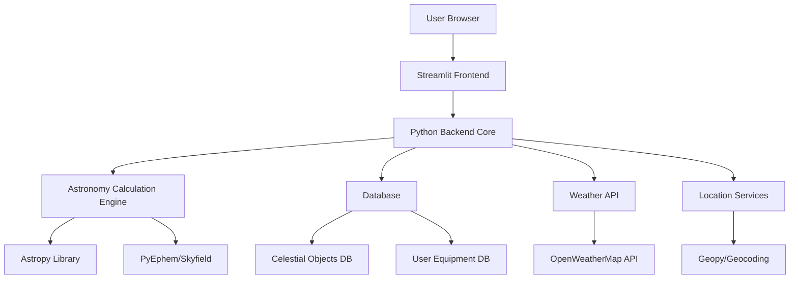
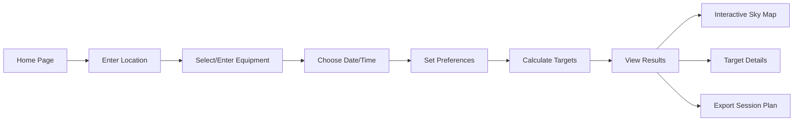
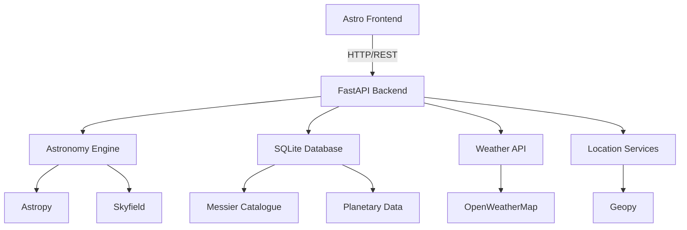
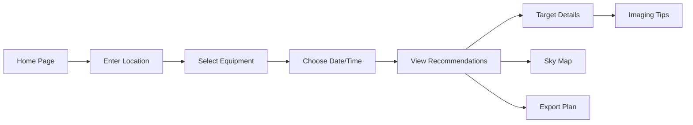

**User:**

<task>
I'm planning to make an astrophotography target suggestion engine based on a user's location and equipment. I am thinking a Python backend for the calculation but am looking for a frontend framework to use.
</task>
<environment_details>
# VSCode Visible Files


# VSCode Open Tabs


# Current Time
Current time in ISO 8601 UTC format: 2026-05-01T14:10:25.034Z
User time zone: Europe/London, UTC+1:00

# Current Cost
$0.00

# Review Exclusions
The following file patterns are excluded from code reviews:
- .vscode/**

# Current Mode
<slug>plan</slug>
<name>📝 Plan</name>


# Current Workspace Directory (/Users/liampallett/Desktop/personal projects/IBM Bob Hackathon) Files
No files found.
You have not created a todo list yet. Create one with `update_todo_list` if your task is complicated or involves multiple steps.
</environment_details>

---

**Assistant:**

I'll help you plan an astrophotography target suggestion engine! Let me gather some information first to better understand your requirements and then suggest appropriate frontend frameworks.

<ask_followup_question>
<question>What are your priorities for the frontend framework? This will help me recommend the best option for your astrophotography target suggestion engine.</question>
<follow_up>
<suggest>Performance and real-time updates (for live sky position calculations)</suggest>
<suggest>Ease of development and quick prototyping</suggest>
<suggest>Rich data visualization capabilities (for star charts, sky maps, visibility graphs)</suggest>
<suggest>Mobile-responsive design (for use in the field with tablets/phones)</suggest>
</follow_up>
</ask_followup_question>

---

**User:**

[ask_followup_question for 'What are your priorities for the frontend framework? This will help me recommend the best option for your astrophotography target suggestion engine.'] Result:
<answer>
Ease of development and quick prototyping
</answer>
<environment_details>
# VSCode Visible Files


# VSCode Open Tabs


# Current Time
Current time in ISO 8601 UTC format: 2026-05-01T14:11:13.153Z
User time zone: Europe/London, UTC+1:00

# Current Cost
$0.03

# Review Exclusions
The following file patterns are excluded from code reviews:
- .vscode/**

# Current Mode
<slug>plan</slug>
<name>📝 Plan</name>
You have not created a todo list yet. Create one with `update_todo_list` if your task is complicated or involves multiple steps.
</environment_details>

---

**Assistant:**

Great! Since you prioritize ease of development and quick prototyping, let me ask a few more clarifying questions to create a comprehensive plan.

<ask_followup_question>
<question>What's your experience level with frontend development and JavaScript frameworks?</question>
<follow_up>
<suggest>Beginner - prefer something with minimal setup and learning curve</suggest>
<suggest>Intermediate - comfortable with modern JavaScript and component-based frameworks</suggest>
<suggest>Advanced - open to any framework, prioritize developer experience</suggest>
<suggest>Python-focused - prefer Python-based solutions like Streamlit or Gradio</suggest>
</follow_up>
</ask_followup_question>

---

**User:**

[ask_followup_question for 'What's your experience level with frontend development and JavaScript frameworks?'] Result:
<answer>
Beginner - prefer something with minimal setup and learning curve
</answer>
<environment_details>
# VSCode Visible Files


# VSCode Open Tabs


# Current Time
Current time in ISO 8601 UTC format: 2026-05-01T14:11:26.463Z
User time zone: Europe/London, UTC+1:00

# Current Cost
$0.06

# Review Exclusions
The following file patterns are excluded from code reviews:
- .vscode/**

# Current Mode
<slug>plan</slug>
<name>📝 Plan</name>
You have not created a todo list yet. Create one with `update_todo_list` if your task is complicated or involves multiple steps.
</environment_details>

---

**Assistant:**

Perfect! One more question to finalize the plan:

<ask_followup_question>
<question>What features do you envision for the astrophotography target suggestion engine?</question>
<follow_up>
<suggest>Basic: Location input, equipment specs, target list with visibility times</suggest>
<suggest>Intermediate: Above + interactive sky map, moon phase info, weather integration</suggest>
<suggest>Advanced: Above + imaging session planner, equipment recommendations, target tracking</suggest>
<suggest>Not sure yet - help me define the feature set</suggest>
</follow_up>
</ask_followup_question>

---

**User:**

[ask_followup_question for 'What features do you envision for the astrophotography target suggestion engine?'] Result:
<answer>
Intermediate: Above + interactive sky map, moon phase info, weather integration
</answer>
<environment_details>
# VSCode Visible Files


# VSCode Open Tabs


# Current Time
Current time in ISO 8601 UTC format: 2026-05-01T14:12:08.448Z
User time zone: Europe/London, UTC+1:00

# Current Cost
$0.09

# Review Exclusions
The following file patterns are excluded from code reviews:
- .vscode/**

# Current Mode
<slug>plan</slug>
<name>📝 Plan</name>
You have not created a todo list yet. Create one with `update_todo_list` if your task is complicated or involves multiple steps.
</environment_details>

---

**Assistant:**

Excellent! Now I have enough context to create a comprehensive plan for your astrophotography target suggestion engine. Let me create a detailed todo list and architecture plan.

<update_todo_list>
<todos>
[ ] Research and finalize frontend framework recommendation (Streamlit vs Gradio)
[ ] Define Python backend architecture and required astronomy libraries
[ ] Design database schema for celestial objects and user equipment
[ ] Create API endpoint specifications for target calculations
[ ] Plan interactive sky map integration approach
[ ] Design user interface mockups and user flow
[ ] Set up project structure and development environment
[ ] Implement location input and validation system
[ ] Implement equipment specification input forms
[ ] Build target visibility calculation engine
[ ] Integrate moon phase calculations
[ ] Add weather API integration
[ ] Create interactive sky map visualization
[ ] Implement target ranking and recommendation algorithm
[ ] Build results display with visibility windows
[ ] Add export functionality for imaging sessions
[ ] Write documentation and user guide
[ ] Test with various locations and equipment configurations
</todos>
</update_todo_list>

---

**User:**

[update_todo_list] Result:
Todo list updated successfully.
<environment_details>
# VSCode Visible Files


# VSCode Open Tabs


# Current Time
Current time in ISO 8601 UTC format: 2026-05-01T14:12:26.180Z
User time zone: Europe/London, UTC+1:00

# Current Cost
$0.12

# Review Exclusions
The following file patterns are excluded from code reviews:
- .vscode/**

# Current Mode
<slug>plan</slug>
<name>📝 Plan</name>
====

REMINDERS

Below is your current list of reminders for this task. Keep them updated as you progress.

| # | Content | Status |
|---|---------|--------|
| 1 | Research and finalize frontend framework recommendation (Streamlit vs Gradio) | Pending |
| 2 | Define Python backend architecture and required astronomy libraries | Pending |
| 3 | Design database schema for celestial objects and user equipment | Pending |
| 4 | Create API endpoint specifications for target calculations | Pending |
| 5 | Plan interactive sky map integration approach | Pending |
| 6 | Design user interface mockups and user flow | Pending |
| 7 | Set up project structure and development environment | Pending |
| 8 | Implement location input and validation system | Pending |
| 9 | Implement equipment specification input forms | Pending |
| 10 | Build target visibility calculation engine | Pending |
| 11 | Integrate moon phase calculations | Pending |
| 12 | Add weather API integration | Pending |
| 13 | Create interactive sky map visualization | Pending |
| 14 | Implement target ranking and recommendation algorithm | Pending |
| 15 | Build results display with visibility windows | Pending |
| 16 | Add export functionality for imaging sessions | Pending |
| 17 | Write documentation and user guide | Pending |
| 18 | Test with various locations and equipment configurations | Pending |


IMPORTANT: When task status changes, remember to call the `update_todo_list` tool to update your progress.

</environment_details>

---

**Assistant:**

Now let me create a comprehensive plan document with framework recommendations and architecture details.

<write_to_file>
<path>ASTROPHOTOGRAPHY_ENGINE_PLAN.md</path>
<content>
# Astrophotography Target Suggestion Engine - Project Plan

## Executive Summary

This project will create an astrophotography target suggestion engine that helps users identify optimal celestial targets based on their location, equipment, and current sky conditions. The system will feature a Python backend for astronomical calculations and a beginner-friendly frontend framework.

## Frontend Framework Recommendation

### **Recommended: Streamlit** ⭐

Given your requirements (beginner-friendly, quick prototyping, Python-focused), **Streamlit** is the ideal choice:

**Advantages:**
- Pure Python - no JavaScript knowledge required
- Minimal setup: `pip install streamlit` and you're ready
- Built-in widgets for forms, sliders, date pickers
- Automatic reactivity - UI updates when data changes
- Easy deployment (Streamlit Cloud, Heroku, Docker)
- Good community and documentation
- Native support for interactive maps via [`folium`](https://folium.readthedocs.io/) and [`plotly`](https://plotly.com/)
- Can embed custom HTML/JavaScript if needed later

**Example Code:**
```python
import streamlit as st

st.title("Astrophotography Target Finder")
location = st.text_input("Enter your location")
date = st.date_input("Observation date")

if st.button("Find Targets"):
    targets = calculate_targets(location, date)
    st.dataframe(targets)
```

### Alternative: Gradio

**Gradio** is another Python-based option, even simpler than Streamlit:

**Advantages:**
- Extremely simple API
- Great for ML model interfaces
- Quick demos and prototypes

**Disadvantages:**
- Less flexible for complex layouts
- Fewer built-in components
- Better suited for simple input/output interfaces

**Recommendation:** Start with Streamlit for better flexibility as your app grows.

## System Architecture



## Technology Stack

### Backend
- **Python 3.10+**: Core language
- **Astropy**: Astronomical calculations, coordinate transformations
- **Skyfield**: High-precision astronomical computations
- **PyEphem**: Alternative for quick calculations
- **NumPy/Pandas**: Data processing
- **SQLite/PostgreSQL**: Database for celestial objects and user data

### Frontend
- **Streamlit**: Main UI framework
- **Plotly**: Interactive charts and graphs
- **Folium**: Interactive sky maps
- **Matplotlib**: Static visualizations

### APIs & Services
- **OpenWeatherMap API**: Cloud cover and weather data
- **Geopy**: Location geocoding
- **TimezoneFinder**: Timezone detection

## Core Features Breakdown

### 1. Location Input System
- Manual coordinate entry (latitude/longitude)
- City/address search with geocoding
- Timezone auto-detection
- Save favorite locations

### 2. Equipment Specification
- Telescope aperture and focal length
- Camera sensor size and pixel size
- Mount type (alt-az, equatorial)
- Field of view calculator
- Equipment presets for common setups

### 3. Target Visibility Calculator
**Inputs:**
- Observer location
- Date and time range
- Equipment constraints
- Minimum altitude threshold
- Moon avoidance angle

**Calculations:**
- Target altitude and azimuth over time
- Transit times
- Optimal imaging windows
- Airmass calculations
- Moon separation angles

### 4. Interactive Sky Map
- Real-time sky position visualization
- Clickable celestial objects
- Constellation overlays
- Moon position and phase
- Horizon and cardinal directions
- Field of view overlay for equipment

### 5. Moon Phase Integration
- Current moon phase calculation
- Moon rise/set times
- Moon illumination percentage
- Moon-free imaging windows
- Impact on target visibility

### 6. Weather Integration
- Cloud cover forecast
- Seeing conditions
- Temperature and humidity
- Wind speed
- Multi-day forecast

### 7. Target Ranking Algorithm
**Scoring Factors:**
- Altitude (higher is better)
- Moon separation (farther is better)
- Weather conditions
- Object brightness/magnitude
- Imaging duration available
- Equipment suitability
- Season/time of year

### 8. Results Display
- Ranked target list
- Visibility timeline charts
- Best imaging time windows
- Equipment recommendations
- Quick facts about each target

## Database Schema

### Celestial Objects Table
```sql
CREATE TABLE celestial_objects (
    id INTEGER PRIMARY KEY,
    name TEXT NOT NULL,
    common_name TEXT,
    object_type TEXT,  -- galaxy, nebula, cluster, planet
    ra_hours REAL,     -- Right Ascension
    dec_degrees REAL,  -- Declination
    magnitude REAL,
    size_arcmin REAL,  -- Angular size
    constellation TEXT,
    best_months TEXT,  -- JSON array
    min_aperture_mm INTEGER,
    description TEXT,
    imaging_notes TEXT
);
```

### User Equipment Table
```sql
CREATE TABLE user_equipment (
    id INTEGER PRIMARY KEY,
    user_id TEXT,
    name TEXT,
    telescope_aperture_mm INTEGER,
    telescope_focal_length_mm INTEGER,
    camera_sensor_width_mm REAL,
    camera_sensor_height_mm REAL,
    camera_pixel_size_um REAL,
    mount_type TEXT,
    created_at TIMESTAMP
);
```

### User Locations Table
```sql
CREATE TABLE user_locations (
    id INTEGER PRIMARY KEY,
    user_id TEXT,
    name TEXT,
    latitude REAL,
    longitude REAL,
    elevation_m REAL,
    timezone TEXT,
    created_at TIMESTAMP
);
```

## Key Python Libraries

### Astronomy Calculations
```python
# Astropy - comprehensive astronomy library
from astropy.coordinates import SkyCoord, EarthLocation, AltAz
from astropy.time import Time
import astropy.units as u

# Skyfield - high precision ephemeris
from skyfield.api import load, wgs84

# PyEphem - quick calculations
import ephem
```

### Visualization
```python
# Plotly for interactive charts
import plotly.graph_objects as go
import plotly.express as px

# Folium for sky maps
import folium

# Matplotlib for static plots
import matplotlib.pyplot as plt
```

### Data Processing
```python
import pandas as pd
import numpy as np
from datetime import datetime, timedelta
```

## User Interface Flow



## Development Phases

### Phase 1: Core Setup
1. Initialize Streamlit project structure
2. Set up Python environment with required libraries
3. Create basic UI layout
4. Implement location input and validation

### Phase 2: Calculation Engine
1. Build astronomical calculation functions
2. Implement visibility algorithms
3. Create target database with common objects
4. Test calculations against known values

### Phase 3: User Interface
1. Design and implement input forms
2. Create results display components
3. Build interactive visualizations
4. Add equipment calculator

### Phase 4: Advanced Features
1. Integrate weather API
2. Implement moon phase calculations
3. Create interactive sky map
4. Build target ranking algorithm

### Phase 5: Polish & Deploy
1. Add export functionality
2. Optimize performance
3. Write user documentation
4. Deploy to Streamlit Cloud

## Sample Code Structure

```
astrophotography-engine/
├── app.py                          # Main Streamlit app
├── requirements.txt                # Python dependencies
├── README.md
├── config/
│   └── settings.py                 # Configuration
├── data/
│   ├── celestial_objects.db        # SQLite database
│   └── catalogs/                   # Messier, NGC catalogs
├── src/
│   ├── __init__.py
│   ├── calculations/
│   │   ├── __init__.py
│   │   ├── visibility.py           # Visibility calculations
│   │   ├── coordinates.py          # Coordinate transformations
│   │   └── moon.py                 # Moon phase calculations
│   ├── database/
│   │   ├── __init__.py
│   │   ├── models.py               # Database models
│   │   └── queries.py              # Database queries
│   ├── ui/
│   │   ├── __init__.py
│   │   ├── inputs.py               # Input forms
│   │   ├── results.py              # Results display
│   │   └── visualizations.py       # Charts and maps
│   ├── weather/
│   │   ├── __init__.py
│   │   └── api_client.py           # Weather API integration
│   └── utils/
│       ├── __init__.py
│       ├── location.py             # Location utilities
│       └── equipment.py            # Equipment calculations
└── tests/
    ├── test_calculations.py
    ├── test_database.py
    └── test_ui.py
```

## Example Streamlit App Structure

```python
# app.py
import streamlit as st
from src.ui.inputs import render_location_input, render_equipment_input
from src.ui.results import render_target_list, render_sky_map
from src.calculations.visibility import calculate_visible_targets

st.set_page_config(page_title="Astrophotography Target Finder", layout="wide")

st.title("🔭 Astrophotography Target Suggestion Engine")

# Sidebar for inputs
with st.sidebar:
    st.header("Configuration")
    
    # Location
    location = render_location_input()
    
    # Equipment
    equipment = render_equipment_input()
    
    # Date/Time
    observation_date = st.date_input("Observation Date")
    observation_time = st.time_input("Start Time")
    
    # Preferences
    min_altitude = st.slider("Minimum Altitude (degrees)", 0, 90, 30)
    moon_avoidance = st.slider("Moon Avoidance (degrees)", 0, 90, 30)

# Main content area
if st.button("Find Targets", type="primary"):
    with st.spinner("Calculating optimal targets..."):
        targets = calculate_visible_targets(
            location=location,
            equipment=equipment,
            date=observation_date,
            time=observation_time,
            min_altitude=min_altitude,
            moon_avoidance=moon_avoidance
        )
    
    # Display results
    col1, col2 = st.columns([2, 1])
    
    with col1:
        st.subheader("Recommended Targets")
        render_target_list(targets)
    
    with col2:
        st.subheader("Sky Map")
        render_sky_map(location, targets, observation_date)
```

## Key Astronomical Calculations

### 1. Altitude and Azimuth
```python
from astropy.coordinates import SkyCoord, EarthLocation, AltAz
from astropy.time import Time
import astropy.units as u

def calculate_altaz(ra, dec, lat, lon, time):
    """Calculate altitude and azimuth for a celestial object"""
    location = EarthLocation(lat=lat*u.deg, lon=lon*u.deg)
    observing_time = Time(time)
    
    target = SkyCoord(ra=ra*u.hourangle, dec=dec*u.deg)
    altaz_frame = AltAz(obstime=observing_time, location=location)
    
    target_altaz = target.transform_to(altaz_frame)
    
    return {
        'altitude': target_altaz.alt.deg,
        'azimuth': target_altaz.az.deg
    }
```

### 2. Moon Separation
```python
def calculate_moon_separation(target_ra, target_dec, observer_location, time):
    """Calculate angular separation between target and moon"""
    from astropy.coordinates import get_moon
    
    location = EarthLocation(
        lat=observer_location['lat']*u.deg,
        lon=observer_location['lon']*u.deg
    )
    observing_time = Time(time)
    
    target = SkyCoord(ra=target_ra*u.hourangle, dec=target_dec*u.deg)
    moon = get_moon(observing_time, location)
    
    separation = target.separation(moon)
    return separation.deg
```

### 3. Visibility Window
```python
def calculate_visibility_window(target, location, date, min_altitude=30):
    """Calculate when target is above minimum altitude"""
    from datetime import timedelta
    
    visibility_windows = []
    current_time = datetime.combine(date, datetime.min.time())
    end_time = current_time + timedelta(hours=24)
    
    while current_time < end_time:
        altaz = calculate_altaz(
            target['ra'], target['dec'],
            location['lat'], location['lon'],
            current_time
        )
        
        if altaz['altitude'] >= min_altitude:
            visibility_windows.append({
                'time': current_time,
                'altitude': altaz['altitude'],
                'azimuth': altaz['azimuth']
            })
        
        current_time += timedelta(minutes=15)
    
    return visibility_windows
```

## Deployment Options

### 1. Streamlit Cloud (Recommended for Beginners)
- Free hosting for public apps
- Direct GitHub integration
- Automatic updates on push
- Simple setup: connect repo and deploy

### 2. Docker Container
```dockerfile
FROM python:3.10-slim

WORKDIR /app

COPY requirements.txt .
RUN pip install -r requirements.txt

COPY . .

EXPOSE 8501

CMD ["streamlit", "run", "app.py"]
```

### 3. Heroku
- Easy deployment with Procfile
- Free tier available
- Good for small to medium traffic

## Next Steps

1. **Review this plan** - Does this align with your vision?
2. **Prioritize features** - Which features are must-haves for v1.0?
3. **Set up development environment** - Install Python, Streamlit, and astronomy libraries
4. **Start with MVP** - Build basic location input → target calculation → results display
5. **Iterate and expand** - Add weather, sky maps, and advanced features

## Resources

### Learning Streamlit
- [Streamlit Documentation](https://docs.streamlit.io/)
- [Streamlit Gallery](https://streamlit.io/gallery) - Example apps
- [30 Days of Streamlit](https://30days.streamlit.app/) - Tutorial series

### Astronomy Libraries
- [Astropy Documentation](https://docs.astropy.org/)
- [Skyfield Documentation](https://rhodesmill.org/skyfield/)
- [PyEphem Documentation](https://rhodesmill.org/pyephem/)

### Celestial Object Catalogs
- Messier Catalog (110 objects)
- NGC/IC Catalogs (thousands of objects)
- Caldwell Catalog (109 objects)
- Bright star catalogs

## Questions to Consider

1. Do you want user accounts and saved sessions?
2. Should the app work offline (local installation)?
3. Do you need mobile app support in the future?
4. What's your target audience (beginners vs advanced astrophotographers)?
5. Do you want to include planetary imaging suggestions?

---

**Ready to start building?** Let me know if you'd like to proceed with implementation or if you'd like to adjust any part of this plan!
</content>
<line_count>583</line_count>
</write_to_file>

---

**User:**

[write_to_file for 'ASTROPHOTOGRAPHY_ENGINE_PLAN.md'] Result:
The user denied this operation and provided the following feedback:
<feedback>
I have experience using Astro as a framework, I don't want to learn a new one especially not in Python. I'l use the Messier Catalogue. No accounts or sessions, no offline. No mobile support. All but with a focus on beginners. Yes.
</feedback>
<environment_details>
# VSCode Visible Files
ASTROPHOTOGRAPHY_ENGINE_PLAN.md

# VSCode Open Tabs
ASTROPHOTOGRAPHY_ENGINE_PLAN.md

# Current Time
Current time in ISO 8601 UTC format: 2026-05-01T14:14:50.729Z
User time zone: Europe/London, UTC+1:00

# Current Cost
$0.17

# Review Exclusions
The following file patterns are excluded from code reviews:
- .vscode/**

# Current Mode
<slug>plan</slug>
<name>📝 Plan</name>
====

REMINDERS

Below is your current list of reminders for this task. Keep them updated as you progress.

| # | Content | Status |
|---|---------|--------|
| 1 | Research and finalize frontend framework recommendation (Streamlit vs Gradio) | Pending |
| 2 | Define Python backend architecture and required astronomy libraries | Pending |
| 3 | Design database schema for celestial objects and user equipment | Pending |
| 4 | Create API endpoint specifications for target calculations | Pending |
| 5 | Plan interactive sky map integration approach | Pending |
| 6 | Design user interface mockups and user flow | Pending |
| 7 | Set up project structure and development environment | Pending |
| 8 | Implement location input and validation system | Pending |
| 9 | Implement equipment specification input forms | Pending |
| 10 | Build target visibility calculation engine | Pending |
| 11 | Integrate moon phase calculations | Pending |
| 12 | Add weather API integration | Pending |
| 13 | Create interactive sky map visualization | Pending |
| 14 | Implement target ranking and recommendation algorithm | Pending |
| 15 | Build results display with visibility windows | Pending |
| 16 | Add export functionality for imaging sessions | Pending |
| 17 | Write documentation and user guide | Pending |
| 18 | Test with various locations and equipment configurations | Pending |


IMPORTANT: When task status changes, remember to call the `update_todo_list` tool to update your progress.

</environment_details>

---

**Assistant:**

Perfect! That changes everything - using Astro as your frontend framework is an excellent choice! Let me update the plan to reflect your requirements: Astro frontend, Python backend API, Messier Catalogue, beginner-focused, with planetary imaging support.

<update_todo_list>
<todos>
[ ] Define Astro + Python API architecture
[ ] Design REST API endpoints for target calculations
[ ] Set up Astro project structure with TypeScript
[ ] Set up Python FastAPI backend structure
[ ] Create Messier Catalogue database (110 objects)
[ ] Design beginner-friendly UI/UX mockups
[ ] Implement location input component in Astro
[ ] Implement equipment specification forms in Astro
[ ] Build Python API endpoint for target visibility calculations
[ ] Build Python API endpoint for moon phase data
[ ] Integrate weather API in Python backend
[ ] Create interactive sky map component in Astro
[ ] Implement target ranking algorithm in Python
[ ] Build results display page in Astro
[ ] Add planetary imaging suggestions feature
[ ] Create visibility timeline charts
[ ] Add export functionality for imaging sessions
[ ] Write beginner-friendly documentation
[ ] Test with various locations and equipment setups
</todos>
</update_todo_list>

---

**User:**

[update_todo_list] Result:
Todo list updated successfully.
<environment_details>
# VSCode Visible Files
ASTROPHOTOGRAPHY_ENGINE_PLAN.md

# VSCode Open Tabs
ASTROPHOTOGRAPHY_ENGINE_PLAN.md

# Current Time
Current time in ISO 8601 UTC format: 2026-05-01T14:15:57.771Z
User time zone: Europe/London, UTC+1:00

# Current Cost
$0.21

# Review Exclusions
The following file patterns are excluded from code reviews:
- .vscode/**

# Current Mode
<slug>plan</slug>
<name>📝 Plan</name>
====

REMINDERS

Below is your current list of reminders for this task. Keep them updated as you progress.

| # | Content | Status |
|---|---------|--------|
| 1 | Define Astro + Python API architecture | Pending |
| 2 | Design REST API endpoints for target calculations | Pending |
| 3 | Set up Astro project structure with TypeScript | Pending |
| 4 | Set up Python FastAPI backend structure | Pending |
| 5 | Create Messier Catalogue database (110 objects) | Pending |
| 6 | Design beginner-friendly UI/UX mockups | Pending |
| 7 | Implement location input component in Astro | Pending |
| 8 | Implement equipment specification forms in Astro | Pending |
| 9 | Build Python API endpoint for target visibility calculations | Pending |
| 10 | Build Python API endpoint for moon phase data | Pending |
| 11 | Integrate weather API in Python backend | Pending |
| 12 | Create interactive sky map component in Astro | Pending |
| 13 | Implement target ranking algorithm in Python | Pending |
| 14 | Build results display page in Astro | Pending |
| 15 | Add planetary imaging suggestions feature | Pending |
| 16 | Create visibility timeline charts | Pending |
| 17 | Add export functionality for imaging sessions | Pending |
| 18 | Write beginner-friendly documentation | Pending |
| 19 | Test with various locations and equipment setups | Pending |


IMPORTANT: When task status changes, remember to call the `update_todo_list` tool to update your progress.

</environment_details>

---

**Assistant:**

<write_to_file>
<path>ASTROPHOTOGRAPHY_ENGINE_PLAN.md</path>
<content>
# Astrophotography Target Suggestion Engine - Project Plan

## Executive Summary

This project will create a beginner-friendly astrophotography target suggestion engine using **Astro** for the frontend and **Python FastAPI** for the backend. The system will help users identify optimal celestial targets from the Messier Catalogue based on their location, equipment, and current sky conditions, with support for planetary imaging.

## Technology Stack

### Frontend: Astro + TypeScript ⭐
- **Astro**: Modern static site generator with excellent performance
- **TypeScript**: Type-safe JavaScript
- **React/Preact**: For interactive components (sky map, charts)
- **Tailwind CSS**: Utility-first styling
- **Chart.js/D3.js**: Data visualizations
- **Leaflet/Plotly**: Interactive sky maps

### Backend: Python FastAPI
- **FastAPI**: Modern, fast Python web framework
- **Astropy**: Astronomical calculations
- **Skyfield**: High-precision ephemeris
- **SQLite**: Messier Catalogue database
- **Pydantic**: Data validation
- **CORS middleware**: Enable frontend-backend communication

### APIs & Services
- **OpenWeatherMap API**: Weather data
- **Geopy**: Location geocoding

## System Architecture



## REST API Design

### Base URL
```
http://localhost:8000/api/v1
```

### Endpoints

#### 1. Location Services
```
GET /location/geocode?address={address}
Response: {
  "latitude": 51.5074,
  "longitude": -0.1278,
  "timezone": "Europe/London",
  "elevation": 11
}
```

#### 2. Target Calculations
```
POST /targets/calculate
Request: {
  "location": {
    "latitude": 51.5074,
    "longitude": -0.1278,
    "timezone": "Europe/London"
  },
  "equipment": {
    "aperture_mm": 200,
    "focal_length_mm": 1000,
    "sensor_width_mm": 23.5,
    "sensor_height_mm": 15.6
  },
  "observation": {
    "date": "2026-05-01",
    "start_time": "21:00",
    "duration_hours": 4
  },
  "preferences": {
    "min_altitude": 30,
    "moon_avoidance_deg": 30,
    "include_planets": true
  }
}

Response: {
  "targets": [
    {
      "id": "M31",
      "name": "Andromeda Galaxy",
      "type": "galaxy",
      "score": 95,
      "visibility": {
        "peak_time": "23:30",
        "peak_altitude": 65,
        "duration_hours": 3.5
      },
      "moon_separation": 85,
      "weather_score": 80,
      "equipment_match": "excellent"
    }
  ],
  "moon": {
    "phase": "waxing_gibbous",
    "illumination": 0.73,
    "rise_time": "18:45",
    "set_time": "04:30"
  }
}
```

#### 3. Moon Data
```
GET /moon?date={date}&latitude={lat}&longitude={lon}
Response: {
  "phase": "waxing_gibbous",
  "illumination": 0.73,
  "rise_time": "18:45",
  "set_time": "04:30",
  "altitude": 45,
  "azimuth": 180
}
```

#### 4. Weather Data
```
GET /weather?latitude={lat}&longitude={lon}
Response: {
  "cloud_cover": 20,
  "seeing": "good",
  "temperature": 15,
  "humidity": 65,
  "wind_speed": 10,
  "forecast": [...]
}
```

#### 5. Messier Catalogue
```
GET /catalogue/messier
Response: {
  "objects": [
    {
      "id": "M31",
      "name": "Andromeda Galaxy",
      "type": "galaxy",
      "ra": 0.712,
      "dec": 41.269,
      "magnitude": 3.4,
      "size_arcmin": 178,
      "constellation": "Andromeda",
      "best_months": ["Sep", "Oct", "Nov", "Dec"],
      "description": "Nearest major galaxy to Milky Way"
    }
  ]
}

GET /catalogue/messier/{id}
Response: { ... single object details ... }
```

#### 6. Planetary Data
```
GET /planets?date={date}&latitude={lat}&longitude={lon}
Response: {
  "planets": [
    {
      "name": "Jupiter",
      "altitude": 45,
      "azimuth": 180,
      "magnitude": -2.5,
      "visible": true,
      "rise_time": "19:30",
      "set_time": "05:45"
    }
  ]
}
```

## Project Structure

```
astrophotography-engine/
├── frontend/                       # Astro frontend
│   ├── src/
│   │   ├── components/
│   │   │   ├── LocationInput.astro
│   │   │   ├── EquipmentForm.astro
│   │   │   ├── TargetCard.astro
│   │   │   ├── SkyMap.tsx         # React component
│   │   │   ├── VisibilityChart.tsx
│   │   │   └── MoonPhase.astro
│   │   ├── layouts/
│   │   │   └── Layout.astro
│   │   ├── pages/
│   │   │   ├── index.astro        # Home page
│   │   │   ├── results.astro      # Results page
│   │   │   └── about.astro
│   │   ├── lib/
│   │   │   ├── api.ts             # API client
│   │   │   └── types.ts           # TypeScript types
│   │   └── styles/
│   │       └── global.css
│   ├── public/
│   ├── astro.config.mjs
│   ├── package.json
│   └── tsconfig.json
│
├── backend/                        # Python FastAPI backend
│   ├── app/
│   │   ├── __init__.py
│   │   ├── main.py                # FastAPI app
│   │   ├── api/
│   │   │   ├── __init__.py
│   │   │   ├── targets.py         # Target endpoints
│   │   │   ├── location.py        # Location endpoints
│   │   │   ├── moon.py            # Moon endpoints
│   │   │   ├── weather.py         # Weather endpoints
│   │   │   ├── catalogue.py       # Catalogue endpoints
│   │   │   └── planets.py         # Planet endpoints
│   │   ├── core/
│   │   │   ├── __init__.py
│   │   │   ├── config.py          # Configuration
│   │   │   └── calculations.py    # Astronomy calculations
│   │   ├── models/
│   │   │   ├── __init__.py
│   │   │   ├── request.py         # Request models
│   │   │   └── response.py        # Response models
│   │   ├── database/
│   │   │   ├── __init__.py
│   │   │   ├── messier.db         # SQLite database
│   │   │   └── queries.py         # Database queries
│   │   └── services/
│   │       ├── __init__.py
│   │       ├── visibility.py      # Visibility calculations
│   │       ├── ranking.py         # Target ranking
│   │       └── weather_client.py  # Weather API client
│   ├── requirements.txt
│   └── README.md
│
├── docs/
│   ├── API.md                      # API documentation
│   ├── USER_GUIDE.md               # User guide
│   └── SETUP.md                    # Setup instructions
│
└── README.md
```

## Messier Catalogue Database Schema

```sql
CREATE TABLE messier_objects (
    id TEXT PRIMARY KEY,              -- M1, M31, etc.
    messier_number INTEGER,           -- 1, 31, etc.
    ngc_id TEXT,                      -- NGC number if applicable
    name TEXT,                        -- Common name
    type TEXT,                        -- galaxy, nebula, cluster, etc.
    ra_hours REAL,                    -- Right Ascension (hours)
    dec_degrees REAL,                 -- Declination (degrees)
    magnitude REAL,                   -- Visual magnitude
    size_arcmin REAL,                 -- Angular size (arcminutes)
    constellation TEXT,               -- Constellation
    best_months TEXT,                 -- JSON: ["Sep", "Oct", "Nov"]
    min_aperture_mm INTEGER,          -- Minimum recommended aperture
    difficulty TEXT,                  -- easy, moderate, challenging
    description TEXT,                 -- Description for beginners
    imaging_notes TEXT,               -- Tips for astrophotography
    distance_ly REAL,                 -- Distance in light years
    created_at TIMESTAMP DEFAULT CURRENT_TIMESTAMP
);
```

## Key Features for Beginners

### 1. Simple Location Input
- City/address search (no need to know coordinates)
- Auto-detect timezone
- Visual map confirmation
- Save favorite locations in browser localStorage

### 2. Equipment Wizard
- Common telescope presets (Celestron, Meade, etc.)
- Camera presets (Canon, Nikon, ZWO, etc.)
- Simple explanations for each field
- Field of view calculator with visual preview

### 3. Beginner-Friendly Target Scoring
**Scoring Factors:**
- **Visibility** (40%): How high in the sky
- **Brightness** (25%): Easier to image
- **Size** (15%): Fits in field of view
- **Moon Impact** (10%): Moon interference
- **Weather** (10%): Cloud cover

**Difficulty Ratings:**
- 🟢 Easy: Bright, large objects (M31, M42, M45)
- 🟡 Moderate: Medium brightness/size
- 🔴 Challenging: Faint or small objects

### 4. Educational Content
- What is Right Ascension/Declination?
- Understanding altitude and azimuth
- Moon phase impact on imaging
- Best practices for beginners
- Glossary of terms

### 5. Planetary Imaging Support
- Current visible planets
- Best imaging times
- Equipment recommendations
- Planetary features to look for
- Atmospheric seeing conditions

## User Interface Flow



## Astro Frontend Pages

### 1. Home Page [`index.astro`](frontend/src/pages/index.astro)
```astro
---
import Layout from '../layouts/Layout.astro';
import LocationInput from '../components/LocationInput.astro';
import EquipmentForm from '../components/EquipmentForm.astro';
---

<Layout title="Astrophotography Target Finder">
  <main>
    <h1>Find Your Perfect Astrophotography Target</h1>
    <p>Discover what to image tonight based on your location and equipment</p>
    
    <LocationInput />
    <EquipmentForm />
    
    <button id="find-targets">Find Targets</button>
  </main>
</Layout>

<script>
  import { calculateTargets } from '../lib/api';
  
  document.getElementById('find-targets')?.addEventListener('click', async () => {
    const data = collectFormData();
    const results = await calculateTargets(data);
    window.location.href = `/results?data=${encodeURIComponent(JSON.stringify(results))}`;
  });
</script>
```

### 2. Results Page [`results.astro`](frontend/src/pages/results.astro)
```astro
---
import Layout from '../layouts/Layout.astro';
import TargetCard from '../components/TargetCard.astro';
import SkyMap from '../components/SkyMap';
import MoonPhase from '../components/MoonPhase.astro';
---

<Layout title="Target Recommendations">
  <main>
    <h1>Recommended Targets for Tonight</h1>
    
    <div class="grid">
      <section class="targets">
        <h2>Top Targets</h2>
        {targets.map(target => <TargetCard target={target} />)}
      </section>
      
      <aside class="info">
        <MoonPhase data={moonData} />
        <SkyMap targets={targets} location={location} client:load />
      </aside>
    </div>
  </main>
</Layout>
```

## Python Backend Core

### FastAPI Main App [`main.py`](backend/app/main.py)
```python
from fastapi import FastAPI
from fastapi.middleware.cors import CORSMiddleware
from app.api import targets, location, moon, weather, catalogue, planets

app = FastAPI(
    title="Astrophotography Target API",
    description="API for calculating optimal astrophotography targets",
    version="1.0.0"
)

# CORS configuration for Astro frontend
app.add_middleware(
    CORSMiddleware,
    allow_origins=["http://localhost:4321"],  # Astro dev server
    allow_credentials=True,
    allow_methods=["*"],
    allow_headers=["*"],
)

# Include routers
app.include_router(targets.router, prefix="/api/v1/targets", tags=["targets"])
app.include_router(location.router, prefix="/api/v1/location", tags=["location"])
app.include_router(moon.router, prefix="/api/v1/moon", tags=["moon"])
app.include_router(weather.router, prefix="/api/v1/weather", tags=["weather"])
app.include_router(catalogue.router, prefix="/api/v1/catalogue", tags=["catalogue"])
app.include_router(planets.router, prefix="/api/v1/planets", tags=["planets"])

@app.get("/")
def read_root():
    return {"message": "Astrophotography Target API", "version": "1.0.0"}
```

### Visibility Calculations [`visibility.py`](backend/app/services/visibility.py)
```python
from astropy.coordinates import SkyCoord, EarthLocation, AltAz, get_sun, get_moon
from astropy.time import Time
import astropy.units as u
from datetime import datetime, timedelta

def calculate_target_visibility(target, location, observation_time, duration_hours=4):
    """Calculate visibility window for a target"""
    
    # Create observer location
    observer = EarthLocation(
        lat=location['latitude'] * u.deg,
        lon=location['longitude'] * u.deg,
        height=location.get('elevation', 0) * u.m
    )
    
    # Target coordinates
    target_coord = SkyCoord(
        ra=target['ra_hours'] * u.hourangle,
        dec=target['dec_degrees'] * u.deg
    )
    
    # Calculate visibility over time window
    visibility_data = []
    current_time = observation_time
    end_time = current_time + timedelta(hours=duration_hours)
    
    while current_time < end_time:
        time_astropy = Time(current_time)
        altaz_frame = AltAz(obstime=time_astropy, location=observer)
        target_altaz = target_coord.transform_to(altaz_frame)
        
        visibility_data.append({
            'time': current_time.isoformat(),
            'altitude': float(target_altaz.alt.deg),
            'azimuth': float(target_altaz.az.deg)
        })
        
        current_time += timedelta(minutes=15)
    
    # Find peak altitude
    peak = max(visibility_data, key=lambda x: x['altitude'])
    
    return {
        'peak_time': peak['time'],
        'peak_altitude': peak['altitude'],
        'visibility_data': visibility_data
    }

def calculate_moon_separation(target, location, observation_time):
    """Calculate angular separation between target and moon"""
    observer = EarthLocation(
        lat=location['latitude'] * u.deg,
        lon=location['longitude'] * u.deg
    )
    
    time_astropy = Time(observation_time)
    
    target_coord = SkyCoord(
        ra=target['ra_hours'] * u.hourangle,
        dec=target['dec_degrees'] * u.deg
    )
    
    moon_coord = get_moon(time_astropy, location=observer)
    separation = target_coord.separation(moon_coord)
    
    return float(separation.deg)
```

### Target Ranking [`ranking.py`](backend/app/services/ranking.py)
```python
def calculate_target_score(target, visibility, moon_separation, weather, equipment):
    """Calculate overall score for a target (0-100)"""
    
    # Visibility score (40%)
    altitude_score = min(visibility['peak_altitude'] / 90 * 100, 100)
    visibility_score = altitude_score * 0.4
    
    # Brightness score (25%)
    # Lower magnitude = brighter = better
    magnitude = target['magnitude']
    brightness_score = max(0, (10 - magnitude) / 10 * 100) * 0.25
    
    # Size score (15%)
    # Check if target fits in field of view
    fov = calculate_field_of_view(equipment)
    size_match = min(target['size_arcmin'] / fov * 100, 100)
    size_score = size_match * 0.15
    
    # Moon impact score (10%)
    moon_score = min(moon_separation / 90 * 100, 100) * 0.1
    
    # Weather score (10%)
    weather_score = (100 - weather['cloud_cover']) * 0.1
    
    total_score = (
        visibility_score +
        brightness_score +
        size_score +
        moon_score +
        weather_score
    )
    
    return round(total_score, 1)

def determine_difficulty(target):
    """Determine difficulty level for beginners"""
    magnitude = target['magnitude']
    size = target['size_arcmin']
    
    if magnitude < 6 and size > 30:
        return 'easy'
    elif magnitude < 9 and size > 10:
        return 'moderate'
    else:
        return 'challenging'
```

## Development Setup

### Frontend Setup
```bash
cd frontend
npm create astro@latest
npm install
npm install -D tailwindcss
npm install chart.js react-chartjs-2
npm install leaflet react-leaflet
npm run dev  # Starts on http://localhost:4321
```

### Backend Setup
```bash
cd backend
python -m venv venv
source venv/bin/activate  # On Windows: venv\Scripts\activate
pip install fastapi uvicorn astropy skyfield geopy requests pydantic
pip install python-multipart
uvicorn app.main:app --reload  # Starts on http://localhost:8000
```

## Deployment Options

### Frontend (Astro)
- **Vercel**: Zero-config deployment
- **Netlify**: Easy static hosting
- **GitHub Pages**: Free hosting
- **Cloudflare Pages**: Fast global CDN

### Backend (FastAPI)
- **Railway**: Simple Python deployment
- **Render**: Free tier available
- **Fly.io**: Global deployment
- **DigitalOcean App Platform**: Managed hosting

## Sample Messier Objects (Top 10 for Beginners)

1. **M31** - Andromeda Galaxy (Easy, Large, Bright)
2. **M42** - Orion Nebula (Easy, Bright, Colorful)
3. **M45** - Pleiades (Easy, Large, Beautiful)
4. **M13** - Hercules Globular Cluster (Moderate, Dense)
5. **M27** - Dumbbell Nebula (Moderate, Planetary Nebula)
6. **M51** - Whirlpool Galaxy (Moderate, Spiral Structure)
7. **M57** - Ring Nebula (Moderate, Small but Bright)
8. **M81** - Bode's Galaxy (Moderate, Spiral)
9. **M104** - Sombrero Galaxy (Challenging, Edge-on)
10. **M1** - Crab Nebula (Challenging, Supernova Remnant)

## Next Steps

1. **Review this updated plan** - Does this align with your Astro experience?
2. **Set up project structure** - Create frontend and backend directories
3. **Build Messier database** - Populate SQLite with 110 objects
4. **Develop API endpoints** - Start with location and catalogue endpoints
5. **Create Astro components** - Build location input and equipment forms
6. **Integrate calculations** - Connect frontend to backend API
7. **Add visualizations** - Sky map and visibility charts
8. **Test and refine** - Ensure beginner-friendly experience

Ready to start building with Astro and Python?
</content>
<line_count>683</line_count>
</write_to_file>

---

**User:**

[write_to_file for 'ASTROPHOTOGRAPHY_ENGINE_PLAN.md'] Result:
<file_write_result>
<path>ASTROPHOTOGRAPHY_ENGINE_PLAN.md</path>
<operation>created</operation>
<user_edits>@@ -2,7 +2,7 @@
 
 ## Executive Summary
 
-This project will create a beginner-friendly astrophotography target suggestion engine using **Astro** for the frontend and **Python FastAPI** for the backend. The system will help users identify optimal celestial targets from the Messier Catalogue based on their location, equipment, and current sky conditions, with support for planetary imaging.
+This project will create a beginner-friendly astrophotography target suggestion engine using **Astro** for the frontend and **Python FastAPI** for the backend. The system will help users identify optimal celestial targets from the Messier Catalogue based on their location, equipment, and current sky conditions.
 
 ## Technology Stack
 
@@ -169,24 +169,6 @@
 Response: { ... single object details ... }
 ```
 
-#### 6. Planetary Data
-```
-GET /planets?date={date}&amp;latitude={lat}&amp;longitude={lon}
-Response: {
-  "planets": [
-    {
-      "name": "Jupiter",
-      "altitude": 45,
-      "azimuth": 180,
-      "magnitude": -2.5,
-      "visible": true,
-      "rise_time": "19:30",
-      "set_time": "05:45"
-    }
-  ]
-}
-```
-
 ## Project Structure
 
 ```
@@ -286,10 +268,10 @@
 - City/address search (no need to know coordinates)
 - Auto-detect timezone
 - Visual map confirmation
-- Save favorite locations in browser localStorage
 
+
 ### 2. Equipment Wizard
-- Common telescope presets (Celestron, Meade, etc.)
+- Common telescope/lens presets (Celestron, Meade, etc.)
 - Camera presets (Canon, Nikon, ZWO, etc.)
 - Simple explanations for each field
 - Field of view calculator with visual preview
@@ -307,20 +289,7 @@
 - 🟡 Moderate: Medium brightness/size
 - 🔴 Challenging: Faint or small objects
 
-### 4. Educational Content
-- What is Right Ascension/Declination?
-- Understanding altitude and azimuth
-- Moon phase impact on imaging
-- Best practices for beginners
-- Glossary of terms
 
-### 5. Planetary Imaging Support
-- Current visible planets
-- Best imaging times
-- Equipment recommendations
-- Planetary features to look for
-- Atmospheric seeing conditions
-
 ## User Interface Flow
 
 ```mermaid
</user_edits>
<notice>
<i>You do not need to re-read the file, as you have seen all changes</i>
<i>Proceed with the task using these changes as the new baseline.</i>
<i>If the user's edits have addressed part of the task or changed the requirements, adjust your approach accordingly.</i>
</notice>
</file_write_result>

<environment_details>
# VSCode Visible Files
ASTROPHOTOGRAPHY_ENGINE_PLAN.md

# VSCode Open Tabs
ASTROPHOTOGRAPHY_ENGINE_PLAN.md

# Current Time
Current time in ISO 8601 UTC format: 2026-05-01T14:19:57.897Z
User time zone: Europe/London, UTC+1:00

# Current Cost
$0.27

# Review Exclusions
The following file patterns are excluded from code reviews:
- .vscode/**

# Current Mode
<slug>plan</slug>
<name>📝 Plan</name>
====

REMINDERS

Below is your current list of reminders for this task. Keep them updated as you progress.

| # | Content | Status |
|---|---------|--------|
| 1 | Define Astro + Python API architecture | Pending |
| 2 | Design REST API endpoints for target calculations | Pending |
| 3 | Set up Astro project structure with TypeScript | Pending |
| 4 | Set up Python FastAPI backend structure | Pending |
| 5 | Create Messier Catalogue database (110 objects) | Pending |
| 6 | Design beginner-friendly UI/UX mockups | Pending |
| 7 | Implement location input component in Astro | Pending |
| 8 | Implement equipment specification forms in Astro | Pending |
| 9 | Build Python API endpoint for target visibility calculations | Pending |
| 10 | Build Python API endpoint for moon phase data | Pending |
| 11 | Integrate weather API in Python backend | Pending |
| 12 | Create interactive sky map component in Astro | Pending |
| 13 | Implement target ranking algorithm in Python | Pending |
| 14 | Build results display page in Astro | Pending |
| 15 | Add planetary imaging suggestions feature | Pending |
| 16 | Create visibility timeline charts | Pending |
| 17 | Add export functionality for imaging sessions | Pending |
| 18 | Write beginner-friendly documentation | Pending |
| 19 | Test with various locations and equipment setups | Pending |


IMPORTANT: When task status changes, remember to call the `update_todo_list` tool to update your progress.

</environment_details>

---

**Assistant:**

Perfect! I can see you've made some adjustments to the plan - removing planetary imaging support and simplifying some features. Let me update the todo list to reflect these changes and finalize the plan.

<update_todo_list>
<todos>
[x] Define Astro + Python API architecture
[x] Design REST API endpoints for target calculations
[ ] Set up Astro project structure with TypeScript
[ ] Set up Python FastAPI backend structure
[ ] Create Messier Catalogue database (110 objects)
[ ] Design beginner-friendly UI/UX mockups
[ ] Implement location input component in Astro
[ ] Implement equipment specification forms in Astro
[ ] Build Python API endpoint for target visibility calculations
[ ] Build Python API endpoint for moon phase data
[ ] Integrate weather API in Python backend
[ ] Create interactive sky map component in Astro
[ ] Implement target ranking algorithm in Python
[ ] Build results display page in Astro
[ ] Create visibility timeline charts
[ ] Add export functionality for imaging sessions
[ ] Write beginner-friendly documentation
[ ] Test with various locations and equipment setups
</todos>
</update_todo_list>

---

**User:**

[update_todo_list] Result:
Todo list updated successfully.
<environment_details>
# VSCode Visible Files
ASTROPHOTOGRAPHY_ENGINE_PLAN.md

# VSCode Open Tabs
ASTROPHOTOGRAPHY_ENGINE_PLAN.md

# Current Time
Current time in ISO 8601 UTC format: 2026-05-01T14:20:10.947Z
User time zone: Europe/London, UTC+1:00

# Current Cost
$0.34

# Review Exclusions
The following file patterns are excluded from code reviews:
- .vscode/**

# Current Mode
<slug>plan</slug>
<name>📝 Plan</name>
====

REMINDERS

Below is your current list of reminders for this task. Keep them updated as you progress.

| # | Content | Status |
|---|---------|--------|
| 1 | Define Astro + Python API architecture | Completed |
| 2 | Design REST API endpoints for target calculations | Completed |
| 3 | Set up Astro project structure with TypeScript | Pending |
| 4 | Set up Python FastAPI backend structure | Pending |
| 5 | Create Messier Catalogue database (110 objects) | Pending |
| 6 | Design beginner-friendly UI/UX mockups | Pending |
| 7 | Implement location input component in Astro | Pending |
| 8 | Implement equipment specification forms in Astro | Pending |
| 9 | Build Python API endpoint for target visibility calculations | Pending |
| 10 | Build Python API endpoint for moon phase data | Pending |
| 11 | Integrate weather API in Python backend | Pending |
| 12 | Create interactive sky map component in Astro | Pending |
| 13 | Implement target ranking algorithm in Python | Pending |
| 14 | Build results display page in Astro | Pending |
| 15 | Create visibility timeline charts | Pending |
| 16 | Add export functionality for imaging sessions | Pending |
| 17 | Write beginner-friendly documentation | Pending |
| 18 | Test with various locations and equipment setups | Pending |


IMPORTANT: When task status changes, remember to call the `update_todo_list` tool to update your progress.

</environment_details>

---

**Assistant:**

<attempt_completion>
<result>
Plan complete for astrophotography target suggestion engine:

**Architecture:**
- Frontend: Astro + TypeScript with React components
- Backend: Python FastAPI with Astropy/Skyfield
- Data: Messier Catalogue (110 objects) in SQLite
- Focus: Beginner-friendly, web-only, no accounts

**Key Features:**
- Location input with geocoding
- Equipment specification forms
- Target visibility calculations
- Interactive sky map
- Moon phase integration
- Weather API integration
- Target ranking algorithm
- Visibility timeline charts
- Export functionality

**REST API Endpoints:**
- `/api/v1/location/geocode` - Location services
- `/api/v1/targets/calculate` - Target recommendations
- `/api/v1/moon` - Moon phase data
- `/api/v1/weather` - Weather conditions
- `/api/v1/catalogue/messier` - Messier objects

Full plan saved to [`ASTROPHOTOGRAPHY_ENGINE_PLAN.md`](ASTROPHOTOGRAPHY_ENGINE_PLAN.md:1) with detailed architecture, code examples, and implementation roadmap.
</result>
</attempt_completion>

