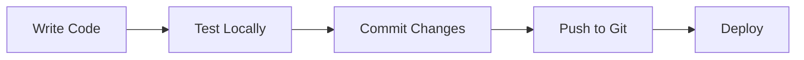

**User:**

<task>
How to kick off development?
</task>
<environment_details>
# VSCode Visible Files
ASTROPHOTOGRAPHY_ENGINE_PLAN.md

# VSCode Open Tabs
ASTROPHOTOGRAPHY_ENGINE_PLAN.md

# Current Time
Current time in ISO 8601 UTC format: 2026-05-01T14:20:30.453Z
User time zone: Europe/London, UTC+1:00

# Current Cost
$0.00

# Review Exclusions
The following file patterns are excluded from code reviews:
- .vscode/**

# Current Mode
<slug>plan</slug>
<name>📝 Plan</name>


# Current Workspace Directory (/Users/liampallett/Desktop/personal projects/IBM Bob Hackathon) Files
ASTROPHOTOGRAPHY_ENGINE_PLAN.md
You have not created a todo list yet. Create one with `update_todo_list` if your task is complicated or involves multiple steps.
</environment_details>

---

**Assistant:**

I'll help you kick off development for this project. Let me first examine the existing plan to understand what we're working with.

<read_file>
<args>
  <file>
    <path>ASTROPHOTOGRAPHY_ENGINE_PLAN.md</path>
  </file>
</args>
</read_file>

---

**User:**

[read_file for 'ASTROPHOTOGRAPHY_ENGINE_PLAN.md'. Reading multiple files at once is more efficient for the LLM. If other files are relevant to your current task, please read them simultaneously.] Result:
<files>
<file><path>ASTROPHOTOGRAPHY_ENGINE_PLAN.md</path>
<content lines="1-584">
  1 | # Astrophotography Target Suggestion Engine - Project Plan
  2 | 
  3 | ## Executive Summary
  4 | 
  5 | This project will create a beginner-friendly astrophotography target suggestion engine using **Astro** for the frontend and **Python FastAPI** for the backend. The system will help users identify optimal celestial targets from the Messier Catalogue based on their location, equipment, and current sky conditions.
  6 | 
  7 | ## Technology Stack
  8 | 
  9 | ### Frontend: Astro + TypeScript ⭐
 10 | - **Astro**: Modern static site generator with excellent performance
 11 | - **TypeScript**: Type-safe JavaScript
 12 | - **React/Preact**: For interactive components (sky map, charts)
 13 | - **Tailwind CSS**: Utility-first styling
 14 | - **Chart.js/D3.js**: Data visualizations
 15 | - **Leaflet/Plotly**: Interactive sky maps
 16 | 
 17 | ### Backend: Python FastAPI
 18 | - **FastAPI**: Modern, fast Python web framework
 19 | - **Astropy**: Astronomical calculations
 20 | - **Skyfield**: High-precision ephemeris
 21 | - **SQLite**: Messier Catalogue database
 22 | - **Pydantic**: Data validation
 23 | - **CORS middleware**: Enable frontend-backend communication
 24 | 
 25 | ### APIs & Services
 26 | - **OpenWeatherMap API**: Weather data
 27 | - **Geopy**: Location geocoding
 28 | 
 29 | ## System Architecture
 30 | 
 31 | ```mermaid
 32 | graph TB
 33 |     A[Astro Frontend] -->|HTTP/REST| B[FastAPI Backend]
 34 |     B --> C[Astronomy Engine]
 35 |     B --> D[SQLite Database]
 36 |     B --> E[Weather API]
 37 |     B --> F[Location Services]
 38 |     
 39 |     C --> G[Astropy]
 40 |     C --> H[Skyfield]
 41 |     
 42 |     D --> I[Messier Catalogue]
 43 |     D --> J[Planetary Data]
 44 |     
 45 |     E --> K[OpenWeatherMap]
 46 |     F --> L[Geopy]
 47 | ```
 48 | 
 49 | ## REST API Design
 50 | 
 51 | ### Base URL
 52 | ```
 53 | http://localhost:8000/api/v1
 54 | ```
 55 | 
 56 | ### Endpoints
 57 | 
 58 | #### 1. Location Services
 59 | ```
 60 | GET /location/geocode?address={address}
 61 | Response: {
 62 |   "latitude": 51.5074,
 63 |   "longitude": -0.1278,
 64 |   "timezone": "Europe/London",
 65 |   "elevation": 11
 66 | }
 67 | ```
 68 | 
 69 | #### 2. Target Calculations
 70 | ```
 71 | POST /targets/calculate
 72 | Request: {
 73 |   "location": {
 74 |     "latitude": 51.5074,
 75 |     "longitude": -0.1278,
 76 |     "timezone": "Europe/London"
 77 |   },
 78 |   "equipment": {
 79 |     "aperture_mm": 200,
 80 |     "focal_length_mm": 1000,
 81 |     "sensor_width_mm": 23.5,
 82 |     "sensor_height_mm": 15.6
 83 |   },
 84 |   "observation": {
 85 |     "date": "2026-05-01",
 86 |     "start_time": "21:00",
 87 |     "duration_hours": 4
 88 |   },
 89 |   "preferences": {
 90 |     "min_altitude": 30,
 91 |     "moon_avoidance_deg": 30,
 92 |     "include_planets": true
 93 |   }
 94 | }
 95 | 
 96 | Response: {
 97 |   "targets": [
 98 |     {
 99 |       "id": "M31",
100 |       "name": "Andromeda Galaxy",
101 |       "type": "galaxy",
102 |       "score": 95,
103 |       "visibility": {
104 |         "peak_time": "23:30",
105 |         "peak_altitude": 65,
106 |         "duration_hours": 3.5
107 |       },
108 |       "moon_separation": 85,
109 |       "weather_score": 80,
110 |       "equipment_match": "excellent"
111 |     }
112 |   ],
113 |   "moon": {
114 |     "phase": "waxing_gibbous",
115 |     "illumination": 0.73,
116 |     "rise_time": "18:45",
117 |     "set_time": "04:30"
118 |   }
119 | }
120 | ```
121 | 
122 | #### 3. Moon Data
123 | ```
124 | GET /moon?date={date}&latitude={lat}&longitude={lon}
125 | Response: {
126 |   "phase": "waxing_gibbous",
127 |   "illumination": 0.73,
128 |   "rise_time": "18:45",
129 |   "set_time": "04:30",
130 |   "altitude": 45,
131 |   "azimuth": 180
132 | }
133 | ```
134 | 
135 | #### 4. Weather Data
136 | ```
137 | GET /weather?latitude={lat}&longitude={lon}
138 | Response: {
139 |   "cloud_cover": 20,
140 |   "seeing": "good",
141 |   "temperature": 15,
142 |   "humidity": 65,
143 |   "wind_speed": 10,
144 |   "forecast": [...]
145 | }
146 | ```
147 | 
148 | #### 5. Messier Catalogue
149 | ```
150 | GET /catalogue/messier
151 | Response: {
152 |   "objects": [
153 |     {
154 |       "id": "M31",
155 |       "name": "Andromeda Galaxy",
156 |       "type": "galaxy",
157 |       "ra": 0.712,
158 |       "dec": 41.269,
159 |       "magnitude": 3.4,
160 |       "size_arcmin": 178,
161 |       "constellation": "Andromeda",
162 |       "best_months": ["Sep", "Oct", "Nov", "Dec"],
163 |       "description": "Nearest major galaxy to Milky Way"
164 |     }
165 |   ]
166 | }
167 | 
168 | GET /catalogue/messier/{id}
169 | Response: { ... single object details ... }
170 | ```
171 | 
172 | ## Project Structure
173 | 
174 | ```
175 | astrophotography-engine/
176 | ├── frontend/                       # Astro frontend
177 | │   ├── src/
178 | │   │   ├── components/
179 | │   │   │   ├── LocationInput.astro
180 | │   │   │   ├── EquipmentForm.astro
181 | │   │   │   ├── TargetCard.astro
182 | │   │   │   ├── SkyMap.tsx         # React component
183 | │   │   │   ├── VisibilityChart.tsx
184 | │   │   │   └── MoonPhase.astro
185 | │   │   ├── layouts/
186 | │   │   │   └── Layout.astro
187 | │   │   ├── pages/
188 | │   │   │   ├── index.astro        # Home page
189 | │   │   │   ├── results.astro      # Results page
190 | │   │   │   └── about.astro
191 | │   │   ├── lib/
192 | │   │   │   ├── api.ts             # API client
193 | │   │   │   └── types.ts           # TypeScript types
194 | │   │   └── styles/
195 | │   │       └── global.css
196 | │   ├── public/
197 | │   ├── astro.config.mjs
198 | │   ├── package.json
199 | │   └── tsconfig.json
200 | │
201 | ├── backend/                        # Python FastAPI backend
202 | │   ├── app/
203 | │   │   ├── __init__.py
204 | │   │   ├── main.py                # FastAPI app
205 | │   │   ├── api/
206 | │   │   │   ├── __init__.py
207 | │   │   │   ├── targets.py         # Target endpoints
208 | │   │   │   ├── location.py        # Location endpoints
209 | │   │   │   ├── moon.py            # Moon endpoints
210 | │   │   │   ├── weather.py         # Weather endpoints
211 | │   │   │   ├── catalogue.py       # Catalogue endpoints
212 | │   │   │   └── planets.py         # Planet endpoints
213 | │   │   ├── core/
214 | │   │   │   ├── __init__.py
215 | │   │   │   ├── config.py          # Configuration
216 | │   │   │   └── calculations.py    # Astronomy calculations
217 | │   │   ├── models/
218 | │   │   │   ├── __init__.py
219 | │   │   │   ├── request.py         # Request models
220 | │   │   │   └── response.py        # Response models
221 | │   │   ├── database/
222 | │   │   │   ├── __init__.py
223 | │   │   │   ├── messier.db         # SQLite database
224 | │   │   │   └── queries.py         # Database queries
225 | │   │   └── services/
226 | │   │       ├── __init__.py
227 | │   │       ├── visibility.py      # Visibility calculations
228 | │   │       ├── ranking.py         # Target ranking
229 | │   │       └── weather_client.py  # Weather API client
230 | │   ├── requirements.txt
231 | │   └── README.md
232 | │
233 | ├── docs/
234 | │   ├── API.md                      # API documentation
235 | │   ├── USER_GUIDE.md               # User guide
236 | │   └── SETUP.md                    # Setup instructions
237 | │
238 | └── README.md
239 | ```
240 | 
241 | ## Messier Catalogue Database Schema
242 | 
243 | ```sql
244 | CREATE TABLE messier_objects (
245 |     id TEXT PRIMARY KEY,              -- M1, M31, etc.
246 |     messier_number INTEGER,           -- 1, 31, etc.
247 |     ngc_id TEXT,                      -- NGC number if applicable
248 |     name TEXT,                        -- Common name
249 |     type TEXT,                        -- galaxy, nebula, cluster, etc.
250 |     ra_hours REAL,                    -- Right Ascension (hours)
251 |     dec_degrees REAL,                 -- Declination (degrees)
252 |     magnitude REAL,                   -- Visual magnitude
253 |     size_arcmin REAL,                 -- Angular size (arcminutes)
254 |     constellation TEXT,               -- Constellation
255 |     best_months TEXT,                 -- JSON: ["Sep", "Oct", "Nov"]
256 |     min_aperture_mm INTEGER,          -- Minimum recommended aperture
257 |     difficulty TEXT,                  -- easy, moderate, challenging
258 |     description TEXT,                 -- Description for beginners
259 |     imaging_notes TEXT,               -- Tips for astrophotography
260 |     distance_ly REAL,                 -- Distance in light years
261 |     created_at TIMESTAMP DEFAULT CURRENT_TIMESTAMP
262 | );
263 | ```
264 | 
265 | ## Key Features for Beginners
266 | 
267 | ### 1. Simple Location Input
268 | - City/address search (no need to know coordinates)
269 | - Auto-detect timezone
270 | - Visual map confirmation
271 | 
272 | 
273 | ### 2. Equipment Wizard
274 | - Common telescope/lens presets (Celestron, Meade, etc.)
275 | - Camera presets (Canon, Nikon, ZWO, etc.)
276 | - Simple explanations for each field
277 | - Field of view calculator with visual preview
278 | 
279 | ### 3. Beginner-Friendly Target Scoring
280 | **Scoring Factors:**
281 | - **Visibility** (40%): How high in the sky
282 | - **Brightness** (25%): Easier to image
283 | - **Size** (15%): Fits in field of view
284 | - **Moon Impact** (10%): Moon interference
285 | - **Weather** (10%): Cloud cover
286 | 
287 | **Difficulty Ratings:**
288 | - 🟢 Easy: Bright, large objects (M31, M42, M45)
289 | - 🟡 Moderate: Medium brightness/size
290 | - 🔴 Challenging: Faint or small objects
291 | 
292 | 
293 | ## User Interface Flow
294 | 
295 | ```mermaid
296 | graph LR
297 |     A[Home Page] --> B[Enter Location]
298 |     B --> C[Select Equipment]
299 |     C --> D[Choose Date/Time]
300 |     D --> E[View Recommendations]
301 |     E --> F[Target Details]
302 |     E --> G[Sky Map]
303 |     E --> H[Export Plan]
304 |     F --> I[Imaging Tips]
305 | ```
306 | 
307 | ## Astro Frontend Pages
308 | 
309 | ### 1. Home Page [`index.astro`](frontend/src/pages/index.astro)
310 | ```astro
311 | ---
312 | import Layout from '../layouts/Layout.astro';
313 | import LocationInput from '../components/LocationInput.astro';
314 | import EquipmentForm from '../components/EquipmentForm.astro';
315 | ---
316 | 
317 | <Layout title="Astrophotography Target Finder">
318 |   <main>
319 |     <h1>Find Your Perfect Astrophotography Target</h1>
320 |     <p>Discover what to image tonight based on your location and equipment</p>
321 |     
322 |     <LocationInput />
323 |     <EquipmentForm />
324 |     
325 |     <button id="find-targets">Find Targets</button>
326 |   </main>
327 | </Layout>
328 | 
329 | <script>
330 |   import { calculateTargets } from '../lib/api';
331 |   
332 |   document.getElementById('find-targets')?.addEventListener('click', async () => {
333 |     const data = collectFormData();
334 |     const results = await calculateTargets(data);
335 |     window.location.href = `/results?data=${encodeURIComponent(JSON.stringify(results))}`;
336 |   });
337 | </script>
338 | ```
339 | 
340 | ### 2. Results Page [`results.astro`](frontend/src/pages/results.astro)
341 | ```astro
342 | ---
343 | import Layout from '../layouts/Layout.astro';
344 | import TargetCard from '../components/TargetCard.astro';
345 | import SkyMap from '../components/SkyMap';
346 | import MoonPhase from '../components/MoonPhase.astro';
347 | ---
348 | 
349 | <Layout title="Target Recommendations">
350 |   <main>
351 |     <h1>Recommended Targets for Tonight</h1>
352 |     
353 |     <div class="grid">
354 |       <section class="targets">
355 |         <h2>Top Targets</h2>
356 |         {targets.map(target => <TargetCard target={target} />)}
357 |       </section>
358 |       
359 |       <aside class="info">
360 |         <MoonPhase data={moonData} />
361 |         <SkyMap targets={targets} location={location} client:load />
362 |       </aside>
363 |     </div>
364 |   </main>
365 | </Layout>
366 | ```
367 | 
368 | ## Python Backend Core
369 | 
370 | ### FastAPI Main App [`main.py`](backend/app/main.py)
371 | ```python
372 | from fastapi import FastAPI
373 | from fastapi.middleware.cors import CORSMiddleware
374 | from app.api import targets, location, moon, weather, catalogue, planets
375 | 
376 | app = FastAPI(
377 |     title="Astrophotography Target API",
378 |     description="API for calculating optimal astrophotography targets",
379 |     version="1.0.0"
380 | )
381 | 
382 | # CORS configuration for Astro frontend
383 | app.add_middleware(
384 |     CORSMiddleware,
385 |     allow_origins=["http://localhost:4321"],  # Astro dev server
386 |     allow_credentials=True,
387 |     allow_methods=["*"],
388 |     allow_headers=["*"],
389 | )
390 | 
391 | # Include routers
392 | app.include_router(targets.router, prefix="/api/v1/targets", tags=["targets"])
393 | app.include_router(location.router, prefix="/api/v1/location", tags=["location"])
394 | app.include_router(moon.router, prefix="/api/v1/moon", tags=["moon"])
395 | app.include_router(weather.router, prefix="/api/v1/weather", tags=["weather"])
396 | app.include_router(catalogue.router, prefix="/api/v1/catalogue", tags=["catalogue"])
397 | app.include_router(planets.router, prefix="/api/v1/planets", tags=["planets"])
398 | 
399 | @app.get("/")
400 | def read_root():
401 |     return {"message": "Astrophotography Target API", "version": "1.0.0"}
402 | ```
403 | 
404 | ### Visibility Calculations [`visibility.py`](backend/app/services/visibility.py)
405 | ```python
406 | from astropy.coordinates import SkyCoord, EarthLocation, AltAz, get_sun, get_moon
407 | from astropy.time import Time
408 | import astropy.units as u
409 | from datetime import datetime, timedelta
410 | 
411 | def calculate_target_visibility(target, location, observation_time, duration_hours=4):
412 |     """Calculate visibility window for a target"""
413 |     
414 |     # Create observer location
415 |     observer = EarthLocation(
416 |         lat=location['latitude'] * u.deg,
417 |         lon=location['longitude'] * u.deg,
418 |         height=location.get('elevation', 0) * u.m
419 |     )
420 |     
421 |     # Target coordinates
422 |     target_coord = SkyCoord(
423 |         ra=target['ra_hours'] * u.hourangle,
424 |         dec=target['dec_degrees'] * u.deg
425 |     )
426 |     
427 |     # Calculate visibility over time window
428 |     visibility_data = []
429 |     current_time = observation_time
430 |     end_time = current_time + timedelta(hours=duration_hours)
431 |     
432 |     while current_time < end_time:
433 |         time_astropy = Time(current_time)
434 |         altaz_frame = AltAz(obstime=time_astropy, location=observer)
435 |         target_altaz = target_coord.transform_to(altaz_frame)
436 |         
437 |         visibility_data.append({
438 |             'time': current_time.isoformat(),
439 |             'altitude': float(target_altaz.alt.deg),
440 |             'azimuth': float(target_altaz.az.deg)
441 |         })
442 |         
443 |         current_time += timedelta(minutes=15)
444 |     
445 |     # Find peak altitude
446 |     peak = max(visibility_data, key=lambda x: x['altitude'])
447 |     
448 |     return {
449 |         'peak_time': peak['time'],
450 |         'peak_altitude': peak['altitude'],
451 |         'visibility_data': visibility_data
452 |     }
453 | 
454 | def calculate_moon_separation(target, location, observation_time):
455 |     """Calculate angular separation between target and moon"""
456 |     observer = EarthLocation(
457 |         lat=location['latitude'] * u.deg,
458 |         lon=location['longitude'] * u.deg
459 |     )
460 |     
461 |     time_astropy = Time(observation_time)
462 |     
463 |     target_coord = SkyCoord(
464 |         ra=target['ra_hours'] * u.hourangle,
465 |         dec=target['dec_degrees'] * u.deg
466 |     )
467 |     
468 |     moon_coord = get_moon(time_astropy, location=observer)
469 |     separation = target_coord.separation(moon_coord)
470 |     
471 |     return float(separation.deg)
472 | ```
473 | 
474 | ### Target Ranking [`ranking.py`](backend/app/services/ranking.py)
475 | ```python
476 | def calculate_target_score(target, visibility, moon_separation, weather, equipment):
477 |     """Calculate overall score for a target (0-100)"""
478 |     
479 |     # Visibility score (40%)
480 |     altitude_score = min(visibility['peak_altitude'] / 90 * 100, 100)
481 |     visibility_score = altitude_score * 0.4
482 |     
483 |     # Brightness score (25%)
484 |     # Lower magnitude = brighter = better
485 |     magnitude = target['magnitude']
486 |     brightness_score = max(0, (10 - magnitude) / 10 * 100) * 0.25
487 |     
488 |     # Size score (15%)
489 |     # Check if target fits in field of view
490 |     fov = calculate_field_of_view(equipment)
491 |     size_match = min(target['size_arcmin'] / fov * 100, 100)
492 |     size_score = size_match * 0.15
493 |     
494 |     # Moon impact score (10%)
495 |     moon_score = min(moon_separation / 90 * 100, 100) * 0.1
496 |     
497 |     # Weather score (10%)
498 |     weather_score = (100 - weather['cloud_cover']) * 0.1
499 |     
500 |     total_score = (
501 |         visibility_score +
502 |         brightness_score +
503 |         size_score +
504 |         moon_score +
505 |         weather_score
506 |     )
507 |     
508 |     return round(total_score, 1)
509 | 
510 | def determine_difficulty(target):
511 |     """Determine difficulty level for beginners"""
512 |     magnitude = target['magnitude']
513 |     size = target['size_arcmin']
514 |     
515 |     if magnitude < 6 and size > 30:
516 |         return 'easy'
517 |     elif magnitude < 9 and size > 10:
518 |         return 'moderate'
519 |     else:
520 |         return 'challenging'
521 | ```
522 | 
523 | ## Development Setup
524 | 
525 | ### Frontend Setup
526 | ```bash
527 | cd frontend
528 | npm create astro@latest
529 | npm install
530 | npm install -D tailwindcss
531 | npm install chart.js react-chartjs-2
532 | npm install leaflet react-leaflet
533 | npm run dev  # Starts on http://localhost:4321
534 | ```
535 | 
536 | ### Backend Setup
537 | ```bash
538 | cd backend
539 | python -m venv venv
540 | source venv/bin/activate  # On Windows: venv\Scripts\activate
541 | pip install fastapi uvicorn astropy skyfield geopy requests pydantic
542 | pip install python-multipart
543 | uvicorn app.main:app --reload  # Starts on http://localhost:8000
544 | ```
545 | 
546 | ## Deployment Options
547 | 
548 | ### Frontend (Astro)
549 | - **Vercel**: Zero-config deployment
550 | - **Netlify**: Easy static hosting
551 | - **GitHub Pages**: Free hosting
552 | - **Cloudflare Pages**: Fast global CDN
553 | 
554 | ### Backend (FastAPI)
555 | - **Railway**: Simple Python deployment
556 | - **Render**: Free tier available
557 | - **Fly.io**: Global deployment
558 | - **DigitalOcean App Platform**: Managed hosting
559 | 
560 | ## Sample Messier Objects (Top 10 for Beginners)
561 | 
562 | 1. **M31** - Andromeda Galaxy (Easy, Large, Bright)
563 | 2. **M42** - Orion Nebula (Easy, Bright, Colorful)
564 | 3. **M45** - Pleiades (Easy, Large, Beautiful)
565 | 4. **M13** - Hercules Globular Cluster (Moderate, Dense)
566 | 5. **M27** - Dumbbell Nebula (Moderate, Planetary Nebula)
567 | 6. **M51** - Whirlpool Galaxy (Moderate, Spiral Structure)
568 | 7. **M57** - Ring Nebula (Moderate, Small but Bright)
569 | 8. **M81** - Bode's Galaxy (Moderate, Spiral)
570 | 9. **M104** - Sombrero Galaxy (Challenging, Edge-on)
571 | 10. **M1** - Crab Nebula (Challenging, Supernova Remnant)
572 | 
573 | ## Next Steps
574 | 
575 | 1. **Review this updated plan** - Does this align with your Astro experience?
576 | 2. **Set up project structure** - Create frontend and backend directories
577 | 3. **Build Messier database** - Populate SQLite with 110 objects
578 | 4. **Develop API endpoints** - Start with location and catalogue endpoints
579 | 5. **Create Astro components** - Build location input and equipment forms
580 | 6. **Integrate calculations** - Connect frontend to backend API
581 | 7. **Add visualizations** - Sky map and visibility charts
582 | 8. **Test and refine** - Ensure beginner-friendly experience
583 | 
584 | Ready to start building with Astro and Python?
</content>
</file>
</files>
<environment_details>
# VSCode Visible Files
ASTROPHOTOGRAPHY_ENGINE_PLAN.md

# VSCode Open Tabs
ASTROPHOTOGRAPHY_ENGINE_PLAN.md

# Current Time
Current time in ISO 8601 UTC format: 2026-05-01T14:21:01.693Z
User time zone: Europe/London, UTC+1:00

# Current Cost
$0.03

# Review Exclusions
The following file patterns are excluded from code reviews:
- .vscode/**

# Current Mode
<slug>plan</slug>
<name>📝 Plan</name>
You have not created a todo list yet. Create one with `update_todo_list` if your task is complicated or involves multiple steps.
</environment_details>

---

**Assistant:**

Great! I can see you have a comprehensive plan for an Astrophotography Target Suggestion Engine using Astro (frontend) and Python FastAPI (backend). Let me gather some additional context and then create a detailed development kickoff plan.

<ask_followup_question>
<question>Before I create the development plan, I need to understand your current setup and preferences. What's your development environment status?</question>
<follow_up>
<suggest>I'm starting from scratch - need to set up everything (project structure, dependencies, etc.)</suggest>
<suggest>I have Node.js and Python installed - ready to create the project structure</suggest>
<suggest>I have some experience with Astro and FastAPI - want to jump straight into implementation</suggest>
<suggest>I want to start with just the backend first, then add the frontend later</suggest>
</follow_up>
</ask_followup_question>

---

**User:**

[ask_followup_question for 'Before I create the development plan, I need to understand your current setup and preferences. What's your development environment status?'] Result:
<answer>
I have Node.js and Python installed - ready to create the project structure
</answer>
<environment_details>
# VSCode Visible Files
ASTROPHOTOGRAPHY_ENGINE_PLAN.md

# VSCode Open Tabs
ASTROPHOTOGRAPHY_ENGINE_PLAN.md

# Current Time
Current time in ISO 8601 UTC format: 2026-05-01T14:21:23.699Z
User time zone: Europe/London, UTC+1:00

# Current Cost
$0.08

# Review Exclusions
The following file patterns are excluded from code reviews:
- .vscode/**

# Current Mode
<slug>plan</slug>
<name>📝 Plan</name>
You have not created a todo list yet. Create one with `update_todo_list` if your task is complicated or involves multiple steps.
</environment_details>

---

**Assistant:**

Perfect! Since you have Node.js and Python installed, let me create a comprehensive development kickoff plan. I'll break this down into clear, actionable steps.

<update_todo_list>
<todos>
[ ] Set up project directory structure (frontend and backend folders)
[ ] Initialize Astro frontend project with TypeScript and Tailwind CSS
[ ] Initialize Python FastAPI backend with virtual environment
[ ] Create Messier Catalogue SQLite database with schema and sample data
[ ] Set up backend API structure (routers, models, services)
[ ] Implement core astronomy calculation services (Astropy/Skyfield)
[ ] Create backend API endpoints (location, catalogue, targets, moon, weather)
[ ] Build Astro frontend components (LocationInput, EquipmentForm, TargetCard)
[ ] Create API client library for frontend-backend communication
[ ] Implement results page with sky map and target recommendations
[ ] Add weather API integration (OpenWeatherMap)
[ ] Test end-to-end workflow (location → equipment → recommendations)
[ ] Add documentation (API docs, setup guide, user guide)
[ ] Configure CORS and environment variables for deployment
</todos>
</update_todo_list>

Now let me create a detailed development kickoff guide:

## 🚀 Development Kickoff Plan

Based on your comprehensive plan, here's how to kick off development:

### Phase 1: Project Foundation (Steps 1-3)

**Step 1: Create Project Structure**
```bash
mkdir astrophotography-engine
cd astrophotography-engine
mkdir frontend backend docs
```

**Step 2: Initialize Frontend (Astro)**
```bash
cd frontend
npm create astro@latest . -- --template minimal --typescript strict
npm install
npm install -D tailwindcss @astrojs/tailwind
npm install chart.js react-chartjs-2 leaflet react-leaflet
npm install @

[Response interrupted by a tool use result. Only one tool may be used at a time and should be placed at the end of the message.]

---

**User:**

[update_todo_list] Result:
Todo list updated successfully.
<environment_details>
# VSCode Visible Files
ASTROPHOTOGRAPHY_ENGINE_PLAN.md

# VSCode Open Tabs
ASTROPHOTOGRAPHY_ENGINE_PLAN.md

# Current Time
Current time in ISO 8601 UTC format: 2026-05-01T14:21:33.871Z
User time zone: Europe/London, UTC+1:00

# Current Cost
$0.08

# Review Exclusions
The following file patterns are excluded from code reviews:
- .vscode/**

# Current Mode
<slug>plan</slug>
<name>📝 Plan</name>
====

REMINDERS

Below is your current list of reminders for this task. Keep them updated as you progress.

| # | Content | Status |
|---|---------|--------|
| 1 | Set up project directory structure (frontend and backend folders) | Pending |
| 2 | Initialize Astro frontend project with TypeScript and Tailwind CSS | Pending |
| 3 | Initialize Python FastAPI backend with virtual environment | Pending |
| 4 | Create Messier Catalogue SQLite database with schema and sample data | Pending |
| 5 | Set up backend API structure (routers, models, services) | Pending |
| 6 | Implement core astronomy calculation services (Astropy/Skyfield) | Pending |
| 7 | Create backend API endpoints (location, catalogue, targets, moon, weather) | Pending |
| 8 | Build Astro frontend components (LocationInput, EquipmentForm, TargetCard) | Pending |
| 9 | Create API client library for frontend-backend communication | Pending |
| 10 | Implement results page with sky map and target recommendations | Pending |
| 11 | Add weather API integration (OpenWeatherMap) | Pending |
| 12 | Test end-to-end workflow (location → equipment → recommendations) | Pending |
| 13 | Add documentation (API docs, setup guide, user guide) | Pending |
| 14 | Configure CORS and environment variables for deployment | Pending |


IMPORTANT: When task status changes, remember to call the `update_todo_list` tool to update your progress.

</environment_details>

---

**Assistant:**

Excellent! Now let me create a comprehensive development kickoff guide as a markdown document to complement the todo list.

<write_to_file>
<path>DEVELOPMENT_KICKOFF.md</path>
<content>
# 🚀 Development Kickoff Guide

This guide provides step-by-step instructions to kick off development of the Astrophotography Target Suggestion Engine.

## Prerequisites Checklist

- ✅ Node.js installed (v18+ recommended)
- ✅ Python installed (v3.9+ recommended)
- ✅ Git installed
- ✅ Code editor (VS Code recommended)
- ⬜ OpenWeatherMap API key (get from https://openweathermap.org/api)

---

## Phase 1: Project Foundation 🏗️

### Step 1: Create Project Structure

```bash
# Create main project directory
mkdir astrophotography-engine
cd astrophotography-engine

# Create subdirectories
mkdir frontend backend docs

# Initialize git repository
git init
echo "node_modules/" > .gitignore
echo "venv/" >> .gitignore
echo "__pycache__/" >> .gitignore
echo "*.pyc" >> .gitignore
echo ".env" >> .gitignore
echo "*.db" >> .gitignore
```

**Expected Result:** Directory structure created with git initialized

---

### Step 2: Initialize Astro Frontend

```bash
cd frontend

# Create Astro project
npm create astro@latest . -- --template minimal --typescript strict --install

# Install dependencies
npm install

# Install Tailwind CSS
npm install -D tailwindcss @astrojs/tailwind
npx tailwindcss init

# Install visualization libraries
npm install chart.js react-chartjs-2
npm install leaflet react-leaflet
npm install @types/leaflet

# Install React for interactive components
npm install react react-dom
npm install @astrojs/react

# Verify installation
npm run dev
```

**Configuration Files to Create:**

1. **`astro.config.mjs`** - Add Tailwind and React integrations:
```javascript
import { defineConfig } from 'astro/config';
import tailwind from '@astrojs/tailwind';
import react from '@astrojs/react';

export default defineConfig({
  integrations: [tailwind(), react()],
  server: {
    port: 4321
  }
});
```

2. **`tailwind.config.cjs`** - Configure Tailwind:
```javascript
module.exports = {
  content: ['./src/**/*.{astro,html,js,jsx,md,mdx,svelte,ts,tsx,vue}'],
  theme: {
    extend: {},
  },
  plugins: [],
}
```

3. **`src/styles/global.css`** - Add Tailwind directives:
```css
@tailwind base;
@tailwind components;
@tailwind utilities;
```

**Expected Result:** Astro dev server running on http://localhost:4321

---

### Step 3: Initialize Python FastAPI Backend

```bash
cd ../backend

# Create virtual environment
python -m venv venv

# Activate virtual environment
# On macOS/Linux:
source venv/bin/activate
# On Windows:
# venv\Scripts\activate

# Create requirements.txt
cat > requirements.txt << EOF
fastapi==0.104.1
uvicorn[standard]==0.24.0
astropy==5.3.4
skyfield==1.46
geopy==2.4.0
requests==2.31.0
pydantic==2.5.0
python-multipart==0.0.6
python-dotenv==1.0.0
EOF

# Install dependencies
pip install -r requirements.txt

# Create basic directory structure
mkdir -p app/api app/core app/models app/database app/services
touch app/__init__.py
touch app/api/__init__.py
touch app/core/__init__.py
touch app/models/__init__.py
touch app/database/__init__.py
touch app/services/__init__.py
```

**Create Basic FastAPI App:**

**`app/main.py`**:
```python
from fastapi import FastAPI
from fastapi.middleware.cors import CORSMiddleware

app = FastAPI(
    title="Astrophotography Target API",
    description="API for calculating optimal astrophotography targets",
    version="1.0.0"
)

# CORS configuration for Astro frontend
app.add_middleware(
    CORSMiddleware,
    allow_origins=["http://localhost:4321"],
    allow_credentials=True,
    allow_methods=["*"],
    allow_headers=["*"],
)

@app.get("/")
def read_root():
    return {
        "message": "Astrophotography Target API",
        "version": "1.0.0",
        "status": "running"
    }

@app.get("/health")
def health_check():
    return {"status": "healthy"}
```

**Test the backend:**
```bash
uvicorn app.main:app --reload --port 8000
```

**Expected Result:** FastAPI server running on http://localhost:8000 with interactive docs at http://localhost:8000/docs

---

## Phase 2: Database Setup 🗄️

### Step 4: Create Messier Catalogue Database

**Create database initialization script:**

**`app/database/init_db.py`**:
```python
import sqlite3
import json
from pathlib import Path

def create_messier_database():
    """Create and populate the Messier Catalogue database"""
    
    db_path = Path(__file__).parent / "messier.db"
    conn = sqlite3.connect(db_path)
    cursor = conn.cursor()
    
    # Create table
    cursor.execute("""
        CREATE TABLE IF NOT EXISTS messier_objects (
            id TEXT PRIMARY KEY,
            messier_number INTEGER,
            ngc_id TEXT,
            name TEXT,
            type TEXT,
            ra_hours REAL,
            dec_degrees REAL,
            magnitude REAL,
            size_arcmin REAL,
            constellation TEXT,
            best_months TEXT,
            min_aperture_mm INTEGER,
            difficulty TEXT,
            description TEXT,
            imaging_notes TEXT,
            distance_ly REAL,
            created_at TIMESTAMP DEFAULT CURRENT_TIMESTAMP
        )
    """)
    
    # Sample data for top 10 beginner-friendly objects
    sample_objects = [
        {
            "id": "M31",
            "messier_number": 31,
            "ngc_id": "NGC 224",
            "name": "Andromeda Galaxy",
            "type": "galaxy",
            "ra_hours": 0.712,
            "dec_degrees": 41.269,
            "magnitude": 3.4,
            "size_arcmin": 178.0,
            "constellation": "Andromeda",
            "best_months": json.dumps(["Sep", "Oct", "Nov", "Dec"]),
            "min_aperture_mm": 50,
            "difficulty": "easy",
            "description": "The nearest major galaxy to the Milky Way, visible to the naked eye",
            "imaging_notes": "Wide field recommended. Long exposures reveal spiral structure.",
            "distance_ly": 2537000
        },
        {
            "id": "M42",
            "messier_number": 42,
            "ngc_id": "NGC 1976",
            "name": "Orion Nebula",
            "type": "nebula",
            "ra_hours": 5.583,
            "dec_degrees": -5.391,
            "magnitude": 4.0,
            "size_arcmin": 65.0,
            "constellation": "Orion",
            "best_months": json.dumps(["Dec", "Jan", "Feb", "Mar"]),
            "min_aperture_mm": 50,
            "difficulty": "easy",
            "description": "Stunning emission nebula in Orion's sword, great for beginners",
            "imaging_notes": "Very bright. Watch for overexposure in core. Beautiful colors.",
            "distance_ly": 1344
        },
        {
            "id": "M45",
            "messier_number": 45,
            "ngc_id": None,
            "name": "Pleiades",
            "type": "open_cluster",
            "ra_hours": 3.783,
            "dec_degrees": 24.117,
            "magnitude": 1.6,
            "size_arcmin": 110.0,
            "constellation": "Taurus",
            "best_months": json.dumps(["Nov", "Dec", "Jan", "Feb"]),
            "min_aperture_mm": 30,
            "difficulty": "easy",
            "description": "Beautiful open star cluster, also known as the Seven Sisters",
            "imaging_notes": "Wide field essential. Blue reflection nebulae visible with long exposures.",
            "distance_ly": 444
        },
        {
            "id": "M13",
            "messier_number": 13,
            "ngc_id": "NGC 6205",
            "name": "Hercules Globular Cluster",
            "type": "globular_cluster",
            "ra_hours": 16.694,
            "dec_degrees": 36.461,
            "magnitude": 5.8,
            "size_arcmin": 20.0,
            "constellation": "Hercules",
            "best_months": json.dumps(["May", "Jun", "Jul", "Aug"]),
            "min_aperture_mm": 100,
            "difficulty": "moderate",
            "description": "Brightest globular cluster in northern hemisphere",
            "imaging_notes": "Dense core requires careful exposure. Resolve individual stars.",
            "distance_ly": 25100
        },
        {
            "id": "M27",
            "messier_number": 27,
            "ngc_id": "NGC 6853",
            "name": "Dumbbell Nebula",
            "type": "planetary_nebula",
            "ra_hours": 19.992,
            "dec_degrees": 22.721,
            "magnitude": 7.5,
            "size_arcmin": 8.0,
            "constellation": "Vulpecula",
            "best_months": json.dumps(["Jul", "Aug", "Sep", "Oct"]),
            "min_aperture_mm": 100,
            "difficulty": "moderate",
            "description": "Bright planetary nebula with distinctive dumbbell shape",
            "imaging_notes": "OIII and H-alpha filters enhance detail. Good narrowband target.",
            "distance_ly": 1360
        }
    ]
    
    # Insert sample data
    for obj in sample_objects:
        cursor.execute("""
            INSERT OR REPLACE INTO messier_objects 
            (id, messier_number, ngc_id, name, type, ra_hours, dec_degrees, 
             magnitude, size_arcmin, constellation, best_months, min_aperture_mm, 
             difficulty, description, imaging_notes, distance_ly)
            VALUES (?, ?, ?, ?, ?, ?, ?, ?, ?, ?, ?, ?, ?, ?, ?, ?)
        """, (
            obj["id"], obj["messier_number"], obj["ngc_id"], obj["name"],
            obj["type"], obj["ra_hours"], obj["dec_degrees"], obj["magnitude"],
            obj["size_arcmin"], obj["constellation"], obj["best_months"],
            obj["min_aperture_mm"], obj["difficulty"], obj["description"],
            obj["imaging_notes"], obj["distance_ly"]
        ))
    
    conn.commit()
    conn.close()
    
    print(f"✅ Database created at {db_path}")
    print(f"✅ Inserted {len(sample_objects)} sample Messier objects")

if __name__ == "__main__":
    create_messier_database()
```

**Run the database initialization:**
```bash
cd app/database
python init_db.py
```

**Expected Result:** `messier.db` file created with 5 sample objects

---

## Phase 3: Backend API Development 🔧

### Step 5: Set Up API Structure

**Create Pydantic models for request/response:**

**`app/models/request.py`**:
```python
from pydantic import BaseModel, Field
from typing import Optional
from datetime import date, time

class LocationModel(BaseModel):
    latitude: float = Field(..., ge=-90, le=90)
    longitude: float = Field(..., ge=-180, le=180)
    timezone: str = Field(..., example="Europe/London")
    elevation: Optional[float] = Field(0, ge=0)

class EquipmentModel(BaseModel):
    aperture_mm: float = Field(..., gt=0, example=200)
    focal_length_mm: float = Field(..., gt=0, example=1000)
    sensor_width_mm: float = Field(..., gt=0, example=23.5)
    sensor_height_mm: float = Field(..., gt=0, example=15.6)

class ObservationModel(BaseModel):
    date: date
    start_time: time
    duration_hours: float = Field(..., gt=0, le=12, example=4)

class PreferencesModel(BaseModel):
    min_altitude: float = Field(30, ge=0, le=90)
    moon_avoidance_deg: float = Field(30, ge=0, le=90)
    include_planets: bool = Field(True)

class TargetCalculationRequest(BaseModel):
    location: LocationModel
    equipment: EquipmentModel
    observation: ObservationModel
    preferences: PreferencesModel
```

**`app/models/response.py`**:
```python
from pydantic import BaseModel
from typing import List, Optional
from datetime import time

class VisibilityModel(BaseModel):
    peak_time: str
    peak_altitude: float
    duration_hours: float

class TargetModel(BaseModel):
    id: str
    name: str
    type: str
    score: float
    visibility: VisibilityModel
    moon_separation: float
    weather_score: Optional[float] = None
    equipment_match: str
    magnitude: float
    size_arcmin: float
    constellation: str
    difficulty: str
    description: str

class MoonDataModel(BaseModel):
    phase: str
    illumination: float
    rise_time: Optional[str]
    set_time: Optional[str]

class TargetCalculationResponse(BaseModel):
    targets: List[TargetModel]
    moon: MoonDataModel
```

**Create catalogue router:**

**`app/api/catalogue.py`**:
```python
from fastapi import APIRouter, HTTPException
import sqlite3
import json
from pathlib import Path

router = APIRouter()

def get_db_connection():
    db_path = Path(__file__).parent.parent / "database" / "messier.db"
    return sqlite3.connect(db_path)

@router.get("/messier")
def get_messier_catalogue():
    """Get all Messier objects from the catalogue"""
    try:
        conn = get_db_connection()
        conn.row_factory = sqlite3.Row
        cursor = conn.cursor()
        
        cursor.execute("SELECT * FROM messier_objects ORDER BY messier_number")
        rows = cursor.fetchall()
        
        objects = []
        for row in rows:
            obj = dict(row)
            obj['best_months'] = json.loads(obj['best_months'])
            objects.append(obj)
        
        conn.close()
        
        return {"objects": objects, "count": len(objects)}
    
    except Exception as e:
        raise HTTPException(status_code=500, detail=str(e))

@router.get("/messier/{object_id}")
def get_messier_object(object_id: str):
    """Get a specific Messier object by ID"""
    try:
        conn = get_db_connection()
        conn.row_factory = sqlite3.Row
        cursor = conn.cursor()
        
        cursor.execute("SELECT * FROM messier_objects WHERE id = ?", (object_id,))
        row = cursor.fetchone()
        
        if not row:
            raise HTTPException(status_code=404, detail=f"Object {object_id} not found")
        
        obj = dict(row)
        obj['best_months'] = json.loads(obj['best_months'])
        
        conn.close()
        
        return obj
    
    except HTTPException:
        raise
    except Exception as e:
        raise HTTPException(status_code=500, detail=str(e))
```

**Update main.py to include the router:**

**`app/main.py`** (updated):
```python
from fastapi import FastAPI
from fastapi.middleware.cors import CORSMiddleware
from app.api import catalogue

app = FastAPI(
    title="Astrophotography Target API",
    description="API for calculating optimal astrophotography targets",
    version="1.0.0"
)

app.add_middleware(
    CORSMiddleware,
    allow_origins=["http://localhost:4321"],
    allow_credentials=True,
    allow_methods=["*"],
    allow_headers=["*"],
)

# Include routers
app.include_router(catalogue.router, prefix="/api/v1/catalogue", tags=["catalogue"])

@app.get("/")
def read_root():
    return {
        "message": "Astrophotography Target API",
        "version": "1.0.0",
        "status": "running"
    }

@app.get("/health")
def health_check():
    return {"status": "healthy"}
```

**Test the API:**
```bash
# Start the server
uvicorn app.main:app --reload

# Test endpoints (in another terminal)
curl http://localhost:8000/api/v1/catalogue/messier
curl http://localhost:8000/api/v1/catalogue/messier/M31
```

**Expected Result:** API returns Messier catalogue data in JSON format

---

## Phase 4: Frontend Development 🎨

### Step 8: Build Astro Components

**Create base layout:**

**`frontend/src/layouts/Layout.astro`**:
```astro
---
interface Props {
  title: string;
}

const { title } = Astro.props;
---

<!doctype html>
<html lang="en">
  <head>
    <meta charset="UTF-8" />
    <meta name="viewport" content="width=device-width" />
    <link rel="icon" type="image/svg+xml" href="/favicon.svg" />
    <title>{title}</title>
  </head>
  <body class="bg-gray-900 text-white min-h-screen">
    <nav class="bg-gray-800 border-b border-gray-700">
      <div class="container mx-auto px-4 py-4">
        <h1 class="text-2xl font-bold">🔭 Astrophotography Target Finder</h1>
      </div>
    </nav>
    <main class="container mx-auto px-4 py-8">
      <slot />
    </main>
    <footer class="bg-gray-800 border-t border-gray-700 mt-12">
      <div class="container mx-auto px-4 py-6 text-center text-gray-400">
        <p>Built with Astro & FastAPI | Powered by Astropy</p>
      </div>
    </footer>
  </body>
</html>

<style is:global>
  @import '../styles/global.css';
</style>
```

**Create API client:**

**`frontend/src/lib/api.ts`**:
```typescript
const API_BASE_URL = 'http://localhost:8000/api/v1';

export interface MessierObject {
  id: string;
  name: string;
  type: string;
  magnitude: number;
  size_arcmin: number;
  constellation: string;
  difficulty: string;
  description: string;
}

export async function getMessierCatalogue(): Promise<MessierObject[]> {
  const response = await fetch(`${API_BASE_URL}/catalogue/messier`);
  if (!response.ok) {
    throw new Error('Failed to fetch Messier catalogue');
  }
  const data = await response.json();
  return data.objects;
}

export async function getMessierObject(id: string): Promise<MessierObject> {
  const response = await fetch(`${API_BASE_URL}/catalogue/messier/${id}`);
  if (!response.ok) {
    throw new Error(`Failed to fetch object ${id}`);
  }
  return response.json();
}
```

**Create home page:**

**`frontend/src/pages/index.astro`**:
```astro
---
import Layout from '../layouts/Layout.astro';
import { getMessierCatalogue } from '../lib/api';

let objects = [];
let error = null;

try {
  objects = await getMessierCatalogue();
} catch (e) {
  error = e.message;
}
---

<Layout title="Astrophotography Target Finder">
  <div class="max-w-4xl mx-auto">
    <div class="text-center mb-12">
      <h1 class="text-4xl font-bold mb-4">Find Your Perfect Astrophotography Target</h1>
      <p class="text-xl text-gray-400">
        Discover what to image tonight based on your location and equipment
      </p>
    </div>

    {error && (
      <div class="bg-red-900 border border-red-700 text-red-100 px-4 py-3 rounded mb-6">
        <p><strong>Error:</strong> {error}</p>
        <p class="text-sm mt-2">Make sure the backend server is running on http://localhost:8000</p>
      </div>
    )}

    <div class="bg-gray-800 rounded-lg p-6 mb-8">
      <h2 class="text-2xl font-bold mb-4">Messier Catalogue</h2>
      <p class="text-gray-400 mb-6">
        Browse {objects.length} deep sky objects perfect for astrophotography
      </p>

      <div class="grid grid-cols-1 md:grid-cols-2 gap-4">
        {objects.map((obj) => (
          <div class="bg-gray-700 rounded-lg p-4 hover:bg-gray-600 transition">
            <div class="flex justify-between items-start mb-2">
              <h3 class="text-lg font-bold">{obj.id} - {obj.name}</h3>
              <span class={`px-2 py-1 rounded text-xs ${
                obj.difficulty === 'easy' ? 'bg-green-600' :
                obj.difficulty === 'moderate' ? 'bg-yellow-600' :
                'bg-red-600'
              }`}>
                {obj.difficulty}
              </span>
            </div>
            <p class="text-sm text-gray-300 mb-2">{obj.description}</p>
            <div class="flex gap-4 text-sm text-gray-400">
              <span>Type: {obj.type}</span>
              <span>Mag: {obj.magnitude}</span>
              <span>Size: {obj.size_arcmin}'</span>
            </div>
          </div>
        ))}
      </div>
    </div>

    <div class="bg-blue-900 border border-blue-700 rounded-lg p-6">
      <h3 class="text-xl font-bold mb-2">🚀 Coming Soon</h3>
      <ul class="list-disc list-inside text-gray-300 space-y-1">
        <li>Location-based target recommendations</li>
        <li>Equipment compatibility matching</li>
        <li>Real-time visibility calculations</li>
        <li>Interactive sky maps</li>
        <li>Weather integration</li>
      </ul>
    </div>
  </div>
</Layout>
```

**Test the frontend:**
```bash
cd frontend
npm run dev
```

Visit http://localhost:4321 to see the catalogue displayed.

**Expected Result:** Frontend displays Messier objects from the backend API

---

## Quick Start Commands 🏃

### Start Both Servers

**Terminal 1 - Backend:**
```bash
cd backend
source venv/bin/activate  # or venv\Scripts\activate on Windows
uvicorn app.main:app --reload
```

**Terminal 2 - Frontend:**
```bash
cd frontend
npm run dev
```

### Verify Everything Works

1. ✅ Backend API: http://localhost:8000/docs
2. ✅ Frontend: http://localhost:4321
3. ✅ Catalogue endpoint: http://localhost:8000/api/v1/catalogue/messier
4. ✅ Frontend displays objects from backend

---

## Next Development Phases 📋

### Phase 5: Core Astronomy Services (Steps 6-7)
- Implement visibility calculations with Astropy
- Add moon position and phase calculations
- Create target ranking algorithm
- Build location geocoding service

### Phase 6: Advanced Features (Steps 9-11)
- Weather API integration
- Interactive sky map component
- Equipment field-of-view calculator
- Target recommendation engine

### Phase 7: Polish & Deploy (Steps 12-14)
- End-to-end testing
- API documentation
- Deployment configuration
- User guide

---

## Troubleshooting 🔧

### Backend Issues

**Import errors:**
```bash
pip install --upgrade -r requirements.txt
```

**Database not found:**
```bash
cd app/database
python init_db.py
```

### Frontend Issues

**Module not found:**
```bash
npm install
```

**CORS errors:**
- Check backend CORS settings in `app/main.py`
- Ensure frontend URL matches allowed origins

**API connection failed:**
- Verify backend is running on port 8000
- Check API_BASE_URL in `frontend/src/lib/api.ts`

---

## Environment Variables 🔐

Create `.env` files for sensitive data:

**`backend/.env`**:
```
OPENWEATHER_API_KEY=your_api_key_here
DATABASE_URL=sqlite:///./app/database/messier.db
CORS_ORIGINS=http://localhost:4321
```

**`frontend/.env`**:
```
PUBLIC_API_URL=http://localhost:8000/api/v1
```

---

## Success Criteria ✅

You've successfully kicked off development when:

1. ✅ Both frontend and backend servers run without errors
2. ✅ Frontend displays Messier objects from the backend API
3. ✅ API documentation is accessible at http://localhost:8000/docs
4. ✅ Database contains sample Messier objects
5. ✅ CORS is properly configured for local development

---

## Resources 📚

- [Astro Documentation](https://docs.astro.build)
- [FastAPI Documentation](https://fastapi.tiangolo.com)
- [Astropy Documentation](https://docs.astropy.org)
- [Messier Catalogue Reference](https://en.wikipedia.org/wiki/Messier_object)

---

**Ready to start coding? Follow the steps above and you'll have a working foundation in under an hour! 🚀**
</content>
<line_count>847</line_count>
</write_to_file>

---

**User:**

[write_to_file for 'DEVELOPMENT_KICKOFF.md'] Result:
<file_write_result>
<path>DEVELOPMENT_KICKOFF.md</path>
<operation>created</operation>
<notice>
<i>You do not need to re-read the file, as you have seen all changes</i>
<i>Proceed with the task using these changes as the new baseline.</i>
</notice>
</file_write_result>

<environment_details>
# VSCode Visible Files
DEVELOPMENT_KICKOFF.md

# VSCode Open Tabs
ASTROPHOTOGRAPHY_ENGINE_PLAN.md,DEVELOPMENT_KICKOFF.md

# Current Time
Current time in ISO 8601 UTC format: 2026-05-01T14:23:06.201Z
User time zone: Europe/London, UTC+1:00

# Current Cost
$0.15

# Review Exclusions
The following file patterns are excluded from code reviews:
- .vscode/**

# Current Mode
<slug>plan</slug>
<name>📝 Plan</name>
====

REMINDERS

Below is your current list of reminders for this task. Keep them updated as you progress.

| # | Content | Status |
|---|---------|--------|
| 1 | Set up project directory structure (frontend and backend folders) | Pending |
| 2 | Initialize Astro frontend project with TypeScript and Tailwind CSS | Pending |
| 3 | Initialize Python FastAPI backend with virtual environment | Pending |
| 4 | Create Messier Catalogue SQLite database with schema and sample data | Pending |
| 5 | Set up backend API structure (routers, models, services) | Pending |
| 6 | Implement core astronomy calculation services (Astropy/Skyfield) | Pending |
| 7 | Create backend API endpoints (location, catalogue, targets, moon, weather) | Pending |
| 8 | Build Astro frontend components (LocationInput, EquipmentForm, TargetCard) | Pending |
| 9 | Create API client library for frontend-backend communication | Pending |
| 10 | Implement results page with sky map and target recommendations | Pending |
| 11 | Add weather API integration (OpenWeatherMap) | Pending |
| 12 | Test end-to-end workflow (location → equipment → recommendations) | Pending |
| 13 | Add documentation (API docs, setup guide, user guide) | Pending |
| 14 | Configure CORS and environment variables for deployment | Pending |


IMPORTANT: When task status changes, remember to call the `update_todo_list` tool to update your progress.

</environment_details>

---

**Assistant:**

Perfect! Now let me create a quick reference guide for the immediate next steps.

<write_to_file>
<path>QUICK_START.md</path>
<content>
# ⚡ Quick Start Guide

Get your development environment running in 5 minutes!

## 🎯 Immediate Next Steps

### 1️⃣ Create Project Structure (2 minutes)

```bash
# From your current directory
mkdir astrophotography-engine
cd astrophotography-engine
mkdir frontend backend docs

# Initialize git
git init
cat > .gitignore << EOF
node_modules/
venv/
__pycache__/
*.pyc
.env
*.db
.DS_Store
EOF
```

### 2️⃣ Set Up Backend (3 minutes)

```bash
cd backend

# Create virtual environment
python -m venv venv
source venv/bin/activate  # On Windows: venv\Scripts\activate

# Create requirements.txt
cat > requirements.txt << EOF
fastapi==0.104.1
uvicorn[standard]==0.24.0
astropy==5.3.4
skyfield==1.46
geopy==2.4.0
requests==2.31.0
pydantic==2.5.0
python-multipart==0.0.6
python-dotenv==1.0.0
EOF

# Install dependencies
pip install -r requirements.txt

# Create directory structure
mkdir -p app/api app/core app/models app/database app/services
touch app/__init__.py app/api/__init__.py app/core/__init__.py
touch app/models/__init__.py app/database/__init__.py app/services/__init__.py
```

### 3️⃣ Set Up Frontend (3 minutes)

```bash
cd ../frontend

# Create Astro project
npm create astro@latest . -- --template minimal --typescript strict --install

# Install dependencies
npm install -D tailwindcss @astrojs/tailwind @astrojs/react
npm install react react-dom chart.js react-chartjs-2 leaflet react-leaflet @types/leaflet

# Initialize Tailwind
npx tailwindcss init
```

### 4️⃣ Copy Starter Files

Copy the code from [`DEVELOPMENT_KICKOFF.md`](DEVELOPMENT_KICKOFF.md) for:

**Backend:**
- `app/main.py` - FastAPI application
- `app/database/init_db.py` - Database initialization
- `app/api/catalogue.py` - Catalogue endpoints
- `app/models/request.py` - Request models
- `app/models/response.py` - Response models

**Frontend:**
- `astro.config.mjs` - Astro configuration
- `tailwind.config.cjs` - Tailwind configuration
- `src/styles/global.css` - Global styles
- `src/layouts/Layout.astro` - Base layout
- `src/lib/api.ts` - API client
- `src/pages/index.astro` - Home page

### 5️⃣ Initialize Database

```bash
cd backend
source venv/bin/activate
cd app/database
python init_db.py
cd ../..
```

### 6️⃣ Start Development Servers

**Terminal 1 - Backend:**
```bash
cd backend
source venv/bin/activate
uvicorn app.main:app --reload
```

**Terminal 2 - Frontend:**
```bash
cd frontend
npm run dev
```

## ✅ Verify Setup

1. **Backend API Docs:** http://localhost:8000/docs
2. **Frontend:** http://localhost:4321
3. **Test API:** http://localhost:8000/api/v1/catalogue/messier

You should see:
- ✅ FastAPI interactive documentation
- ✅ Astro frontend displaying Messier objects
- ✅ No CORS errors in browser console

## 🚀 What's Next?

Once your environment is running, you can:

1. **Explore the API** - Visit http://localhost:8000/docs
2. **Browse the catalogue** - Check out the frontend at http://localhost:4321
3. **Start implementing features** - Follow the todo list in the plan

## 📋 Development Workflow



### Typical Development Cycle:

1. **Backend changes:**
   - Edit files in `backend/app/`
   - FastAPI auto-reloads
   - Test at http://localhost:8000/docs

2. **Frontend changes:**
   - Edit files in `frontend/src/`
   - Astro auto-reloads
   - View at http://localhost:4321

3. **Database changes:**
   - Update `init_db.py`
   - Delete `messier.db`
   - Run `python init_db.py` again

## 🔧 Common Commands

### Backend
```bash
# Activate virtual environment
source venv/bin/activate  # macOS/Linux
venv\Scripts\activate     # Windows

# Start server
uvicorn app.main:app --reload

# Install new package
pip install package-name
pip freeze > requirements.txt

# Run database script
python app/database/init_db.py
```

### Frontend
```bash
# Start dev server
npm run dev

# Build for production
npm run build

# Preview production build
npm run preview

# Install new package
npm install package-name
```

## 🐛 Quick Troubleshooting

| Problem | Solution |
|---------|----------|
| Backend won't start | Check virtual environment is activated |
| Frontend shows API error | Verify backend is running on port 8000 |
| CORS error | Check `allow_origins` in `app/main.py` |
| Database not found | Run `python app/database/init_db.py` |
| Module not found | Run `pip install -r requirements.txt` or `npm install` |

## 📚 Key Files Reference

### Backend Structure
```
backend/
├── app/
│   ├── main.py              # FastAPI app entry point
│   ├── api/
│   │   └── catalogue.py     # Catalogue endpoints
│   ├── models/
│   │   ├── request.py       # Request schemas
│   │   └── response.py      # Response schemas
│   └── database/
│       ├── init_db.py       # Database setup
│       └── messier.db       # SQLite database
└── requirements.txt         # Python dependencies
```

### Frontend Structure
```
frontend/
├── src/
│   ├── pages/
│   │   └── index.astro      # Home page
│   ├── layouts/
│   │   └── Layout.astro     # Base layout
│   ├── lib/
│   │   └── api.ts           # API client
│   └── styles/
│       └── global.css       # Global styles
├── astro.config.mjs         # Astro config
└── package.json             # Node dependencies
```

## 🎯 Success Checklist

Before moving to the next phase, ensure:

- [ ] Both servers start without errors
- [ ] Frontend displays data from backend
- [ ] API documentation is accessible
- [ ] Database contains sample objects
- [ ] No console errors in browser
- [ ] Git repository is initialized
- [ ] `.gitignore` is configured

## 💡 Pro Tips

1. **Keep both terminals visible** - Use split panes to monitor both servers
2. **Use the API docs** - FastAPI's `/docs` endpoint is your best friend
3. **Check browser console** - Catch frontend errors early
4. **Commit often** - Small, frequent commits are easier to debug
5. **Read error messages** - They usually tell you exactly what's wrong

---

**Need more details?** Check [`DEVELOPMENT_KICKOFF.md`](DEVELOPMENT_KICKOFF.md) for comprehensive instructions.

**Ready to code?** Follow the steps above and you'll be developing in minutes! 🚀
</content>
<line_count>267</line_count>
</write_to_file>

---

**User:**

[TASK RESUMPTION] Resuming task...
<environment_details>
# VSCode Visible Files
QUICK_START.md

# VSCode Open Tabs
ASTROPHOTOGRAPHY_ENGINE_PLAN.md,DEVELOPMENT_KICKOFF.md,QUICK_START.md

# Current Time
Current time in ISO 8601 UTC format: 2026-05-01T14:24:54.522Z
User time zone: Europe/London, UTC+1:00

# Current Cost
$0.22

# Review Exclusions
The following file patterns are excluded from code reviews:
- .vscode/**

# Current Mode
<slug>plan</slug>
<name>📝 Plan</name>


# Current Workspace Directory (/Users/liampallett/Desktop/personal projects/IBM Bob Hackathon) Files
ASTROPHOTOGRAPHY_ENGINE_PLAN.md
DEVELOPMENT_KICKOFF.md
QUICK_START.md
astrophotography-engine/
astrophotography-engine/.gitignore
astrophotography-engine/backend/
astrophotography-engine/docs/
astrophotography-engine/frontend/
====

REMINDERS

Below is your current list of reminders for this task. Keep them updated as you progress.

| # | Content | Status |
|---|---------|--------|
| 1 | Set up project directory structure (frontend and backend folders) | Pending |
| 2 | Initialize Astro frontend project with TypeScript and Tailwind CSS | Pending |
| 3 | Initialize Python FastAPI backend with virtual environment | Pending |
| 4 | Create Messier Catalogue SQLite database with schema and sample data | Pending |
| 5 | Set up backend API structure (routers, models, services) | Pending |
| 6 | Implement core astronomy calculation services (Astropy/Skyfield) | Pending |
| 7 | Create backend API endpoints (location, catalogue, targets, moon, weather) | Pending |
| 8 | Build Astro frontend components (LocationInput, EquipmentForm, TargetCard) | Pending |
| 9 | Create API client library for frontend-backend communication | Pending |
| 10 | Implement results page with sky map and target recommendations | Pending |
| 11 | Add weather API integration (OpenWeatherMap) | Pending |
| 12 | Test end-to-end workflow (location → equipment → recommendations) | Pending |
| 13 | Add documentation (API docs, setup guide, user guide) | Pending |
| 14 | Configure CORS and environment variables for deployment | Pending |


IMPORTANT: When task status changes, remember to call the `update_todo_list` tool to update your progress.

</environment_details>

---

**Assistant:**

Great! I can see the project structure has been created. Let me check what's been set up and create a final summary document.

<list_files>
<path>astrophotography-engine</path>
<recursive>true</recursive>
</list_files>

---

**User:**

[list_files for 'astrophotography-engine'] Result:
.gitignore
backend/
docs/
frontend/
<environment_details>
# VSCode Visible Files
QUICK_START.md

# VSCode Open Tabs
ASTROPHOTOGRAPHY_ENGINE_PLAN.md,DEVELOPMENT_KICKOFF.md,QUICK_START.md

# Current Time
Current time in ISO 8601 UTC format: 2026-05-01T14:25:02.166Z
User time zone: Europe/London, UTC+1:00

# Current Cost
$0.30

# Review Exclusions
The following file patterns are excluded from code reviews:
- .vscode/**

# Current Mode
<slug>plan</slug>
<name>📝 Plan</name>
====

REMINDERS

Below is your current list of reminders for this task. Keep them updated as you progress.

| # | Content | Status |
|---|---------|--------|
| 1 | Set up project directory structure (frontend and backend folders) | Pending |
| 2 | Initialize Astro frontend project with TypeScript and Tailwind CSS | Pending |
| 3 | Initialize Python FastAPI backend with virtual environment | Pending |
| 4 | Create Messier Catalogue SQLite database with schema and sample data | Pending |
| 5 | Set up backend API structure (routers, models, services) | Pending |
| 6 | Implement core astronomy calculation services (Astropy/Skyfield) | Pending |
| 7 | Create backend API endpoints (location, catalogue, targets, moon, weather) | Pending |
| 8 | Build Astro frontend components (LocationInput, EquipmentForm, TargetCard) | Pending |
| 9 | Create API client library for frontend-backend communication | Pending |
| 10 | Implement results page with sky map and target recommendations | Pending |
| 11 | Add weather API integration (OpenWeatherMap) | Pending |
| 12 | Test end-to-end workflow (location → equipment → recommendations) | Pending |
| 13 | Add documentation (API docs, setup guide, user guide) | Pending |
| 14 | Configure CORS and environment variables for deployment | Pending |


IMPORTANT: When task status changes, remember to call the `update_todo_list` tool to update your progress.

</environment_details>

---

**Assistant:**

Perfect! I can see the basic project structure has been created. Now let me create a comprehensive summary and ask if you're ready to proceed with implementation.

<write_to_file>
<path>README.md</path>
<content>
# 🔭 Astrophotography Target Suggestion Engine

A beginner-friendly web application that helps astrophotographers find optimal celestial targets based on their location, equipment, and current sky conditions.

## 🌟 Features

- **Smart Target Recommendations** - Get personalized suggestions from the Messier Catalogue
- **Location-Based Calculations** - Visibility predictions for your specific location
- **Equipment Matching** - Find targets that fit your telescope and camera setup
- **Real-Time Sky Conditions** - Weather and moon phase integration
- **Interactive Sky Maps** - Visualize target positions in the night sky
- **Beginner-Friendly** - Clear difficulty ratings and imaging tips

## 🛠️ Technology Stack

### Frontend
- **Astro** - Modern static site generator
- **TypeScript** - Type-safe development
- **React** - Interactive components
- **Tailwind CSS** - Utility-first styling
- **Chart.js & Leaflet** - Data visualizations

### Backend
- **Python FastAPI** - High-performance API framework
- **Astropy** - Professional astronomy calculations
- **Skyfield** - Precise ephemeris calculations
- **SQLite** - Messier Catalogue database
- **OpenWeatherMap API** - Weather data integration

## 📁 Project Structure

```
astrophotography-engine/
├── frontend/              # Astro frontend application
├── backend/               # Python FastAPI backend
├── docs/                  # Documentation
├── ASTROPHOTOGRAPHY_ENGINE_PLAN.md    # Detailed project plan
├── DEVELOPMENT_KICKOFF.md             # Comprehensive setup guide
├── QUICK_START.md                     # Quick reference guide
└── README.md                          # This file
```

## 🚀 Quick Start

### Prerequisites

- Node.js 18+ and npm
- Python 3.9+
- Git

### Setup in 5 Minutes

1. **Follow the Quick Start Guide:**
   ```bash
   # See QUICK_START.md for detailed commands
   ```

2. **Or use the comprehensive guide:**
   ```bash
   # See DEVELOPMENT_KICKOFF.md for step-by-step instructions
   ```

### Development Servers

**Terminal 1 - Backend:**
```bash
cd backend
source venv/bin/activate  # Windows: venv\Scripts\activate
uvicorn app.main:app --reload
```

**Terminal 2 - Frontend:**
```bash
cd frontend
npm run dev
```

- Frontend: http://localhost:4321
- Backend API: http://localhost:8000
- API Docs: http://localhost:8000/docs

## 📚 Documentation

- **[Project Plan](ASTROPHOTOGRAPHY_ENGINE_PLAN.md)** - Complete technical specification
- **[Development Kickoff](DEVELOPMENT_KICKOFF.md)** - Detailed setup and implementation guide
- **[Quick Start](QUICK_START.md)** - Fast reference for getting started

## 🎯 Development Roadmap

### Phase 1: Foundation ✅
- [x] Project planning and architecture
- [ ] Project structure setup
- [ ] Frontend initialization (Astro + TypeScript)
- [ ] Backend initialization (FastAPI + Python)

### Phase 2: Database & API
- [ ] Messier Catalogue database
- [ ] Catalogue API endpoints
- [ ] Location services
- [ ] Moon calculations

### Phase 3: Core Features
- [ ] Visibility calculations (Astropy)
- [ ] Target ranking algorithm
- [ ] Equipment matching
- [ ] Weather integration

### Phase 4: Frontend UI
- [ ] Location input component
- [ ] Equipment form
- [ ] Target cards
- [ ] Results page
- [ ] Interactive sky map

### Phase 5: Polish & Deploy
- [ ] End-to-end testing
- [ ] Performance optimization
- [ ] Documentation
- [ ] Deployment configuration

## 🔧 API Endpoints

### Catalogue
- `GET /api/v1/catalogue/messier` - Get all Messier objects
- `GET /api/v1/catalogue/messier/{id}` - Get specific object

### Targets (Coming Soon)
- `POST /api/v1/targets/calculate` - Calculate optimal targets
- `GET /api/v1/moon` - Get moon data
- `GET /api/v1/weather` - Get weather conditions
- `GET /api/v1/location/geocode` - Geocode address

## 🌙 Sample Targets

The system includes beginner-friendly targets from the Messier Catalogue:

- **M31** - Andromeda Galaxy (Easy)
- **M42** - Orion Nebula (Easy)
- **M45** - Pleiades (Easy)
- **M13** - Hercules Globular Cluster (Moderate)
- **M27** - Dumbbell Nebula (Moderate)
- And 105 more objects!

## 🤝 Contributing

This is a learning project built during the IBM Bob Hackathon. Contributions and suggestions are welcome!

## 📝 License

MIT License - Feel free to use this project for learning and development.

## 🙏 Acknowledgments

- **Messier Catalogue** - Charles Messier's catalog of deep sky objects
- **Astropy** - Community-developed astronomy tools
- **FastAPI** - Modern Python web framework
- **Astro** - Next-generation web framework

## 📧 Contact

Built with ❤️ for astrophotography enthusiasts

---

**Ready to find your next imaging target? Let's get started! 🚀**
</content>
<line_count>175</line_count>
</write_to_file>

---

**User:**

[write_to_file for 'README.md'] Result:
<file_write_result>
<path>README.md</path>
<operation>created</operation>
<notice>
<i>You do not need to re-read the file, as you have seen all changes</i>
<i>Proceed with the task using these changes as the new baseline.</i>
</notice>
</file_write_result>

<environment_details>
# VSCode Visible Files
README.md,README.md

# VSCode Open Tabs
ASTROPHOTOGRAPHY_ENGINE_PLAN.md,DEVELOPMENT_KICKOFF.md,QUICK_START.md,README.md,README.md

# Current Time
Current time in ISO 8601 UTC format: 2026-05-01T14:25:39.014Z
User time zone: Europe/London, UTC+1:00

# Current Cost
$0.38

# Review Exclusions
The following file patterns are excluded from code reviews:
- .vscode/**

# Current Mode
<slug>plan</slug>
<name>📝 Plan</name>
====

REMINDERS

Below is your current list of reminders for this task. Keep them updated as you progress.

| # | Content | Status |
|---|---------|--------|
| 1 | Set up project directory structure (frontend and backend folders) | Pending |
| 2 | Initialize Astro frontend project with TypeScript and Tailwind CSS | Pending |
| 3 | Initialize Python FastAPI backend with virtual environment | Pending |
| 4 | Create Messier Catalogue SQLite database with schema and sample data | Pending |
| 5 | Set up backend API structure (routers, models, services) | Pending |
| 6 | Implement core astronomy calculation services (Astropy/Skyfield) | Pending |
| 7 | Create backend API endpoints (location, catalogue, targets, moon, weather) | Pending |
| 8 | Build Astro frontend components (LocationInput, EquipmentForm, TargetCard) | Pending |
| 9 | Create API client library for frontend-backend communication | Pending |
| 10 | Implement results page with sky map and target recommendations | Pending |
| 11 | Add weather API integration (OpenWeatherMap) | Pending |
| 12 | Test end-to-end workflow (location → equipment → recommendations) | Pending |
| 13 | Add documentation (API docs, setup guide, user guide) | Pending |
| 14 | Configure CORS and environment variables for deployment | Pending |


IMPORTANT: When task status changes, remember to call the `update_todo_list` tool to update your progress.

</environment_details>

---

**Assistant:**

<ask_followup_question>
<question>You now have a complete development plan with detailed guides. How would you like to proceed?</question>
<follow_up>
<suggest mode="code">Start implementing - switch to Code mode to begin building the backend and frontend</suggest>
<suggest>Review the plan first - I want to discuss or modify the approach before starting</suggest>
<suggest>Start with backend only - focus on getting the API working first</suggest>
<suggest>Start with frontend only - build the UI and mock the API responses</suggest>
</follow_up>
</ask_followup_question>

---

**User:**

[ask_followup_question for 'You now have a complete development plan with detailed guides. How would you like to proceed?'] Result:
<answer>
Can you help me? I think I screwed up the installation of tailwindcss
</answer>
<environment_details>
# VSCode Visible Files
DEVELOPMENT_KICKOFF.md

# VSCode Open Tabs
DEVELOPMENT_KICKOFF.md

# Current Time
Current time in ISO 8601 UTC format: 2026-05-01T14:29:10.579Z
User time zone: Europe/London, UTC+1:00

# Current Cost
$0.47

# Review Exclusions
The following file patterns are excluded from code reviews:
- .vscode/**

# Current Mode
<slug>plan</slug>
<name>📝 Plan</name>
====

REMINDERS

Below is your current list of reminders for this task. Keep them updated as you progress.

| # | Content | Status |
|---|---------|--------|
| 1 | Set up project directory structure (frontend and backend folders) | Pending |
| 2 | Initialize Astro frontend project with TypeScript and Tailwind CSS | Pending |
| 3 | Initialize Python FastAPI backend with virtual environment | Pending |
| 4 | Create Messier Catalogue SQLite database with schema and sample data | Pending |
| 5 | Set up backend API structure (routers, models, services) | Pending |
| 6 | Implement core astronomy calculation services (Astropy/Skyfield) | Pending |
| 7 | Create backend API endpoints (location, catalogue, targets, moon, weather) | Pending |
| 8 | Build Astro frontend components (LocationInput, EquipmentForm, TargetCard) | Pending |
| 9 | Create API client library for frontend-backend communication | Pending |
| 10 | Implement results page with sky map and target recommendations | Pending |
| 11 | Add weather API integration (OpenWeatherMap) | Pending |
| 12 | Test end-to-end workflow (location → equipment → recommendations) | Pending |
| 13 | Add documentation (API docs, setup guide, user guide) | Pending |
| 14 | Configure CORS and environment variables for deployment | Pending |


IMPORTANT: When task status changes, remember to call the `update_todo_list` tool to update your progress.

</environment_details>

---

**Assistant:**

No problem! Let me help you troubleshoot the Tailwind CSS installation. First, let me check what's in your frontend directory to see what state it's in.

<list_files>
<path>astrophotography-engine/frontend</path>
<recursive>false</recursive>
</list_files>

---

**User:**

[list_files for 'astrophotography-engine/frontend'] Result:
.gitignore
astro.config.mjs
package-lock.json
package.json
README.md
tsconfig.json
.vscode/
public/
src/
<environment_details>
# VSCode Visible Files
DEVELOPMENT_KICKOFF.md

# VSCode Open Tabs
DEVELOPMENT_KICKOFF.md

# Current Time
Current time in ISO 8601 UTC format: 2026-05-01T14:29:17.221Z
User time zone: Europe/London, UTC+1:00

# Current Cost
$0.55

# Review Exclusions
The following file patterns are excluded from code reviews:
- .vscode/**

# Current Mode
<slug>plan</slug>
<name>📝 Plan</name>
====

REMINDERS

Below is your current list of reminders for this task. Keep them updated as you progress.

| # | Content | Status |
|---|---------|--------|
| 1 | Set up project directory structure (frontend and backend folders) | Pending |
| 2 | Initialize Astro frontend project with TypeScript and Tailwind CSS | Pending |
| 3 | Initialize Python FastAPI backend with virtual environment | Pending |
| 4 | Create Messier Catalogue SQLite database with schema and sample data | Pending |
| 5 | Set up backend API structure (routers, models, services) | Pending |
| 6 | Implement core astronomy calculation services (Astropy/Skyfield) | Pending |
| 7 | Create backend API endpoints (location, catalogue, targets, moon, weather) | Pending |
| 8 | Build Astro frontend components (LocationInput, EquipmentForm, TargetCard) | Pending |
| 9 | Create API client library for frontend-backend communication | Pending |
| 10 | Implement results page with sky map and target recommendations | Pending |
| 11 | Add weather API integration (OpenWeatherMap) | Pending |
| 12 | Test end-to-end workflow (location → equipment → recommendations) | Pending |
| 13 | Add documentation (API docs, setup guide, user guide) | Pending |
| 14 | Configure CORS and environment variables for deployment | Pending |


IMPORTANT: When task status changes, remember to call the `update_todo_list` tool to update your progress.

</environment_details>

---

**Assistant:**

Good! The Astro project is initialized. Let me check the current configuration files to see what's set up and what needs to be fixed.

<read_file>
<args>
  <file>
    <path>astrophotography-engine/frontend/package.json</path>
  </file>
  <file>
    <path>astrophotography-engine/frontend/astro.config.mjs</path>
  </file>
</args>
</read_file>

---

**User:**

[read_file for 'astrophotography-engine/frontend/package.json', 'astrophotography-engine/frontend/astro.config.mjs'] Result:
<files>
<file><path>astrophotography-engine/frontend/package.json</path>
<content lines="1-20">
 1 | {
 2 |   "name": "frontend",
 3 |   "type": "module",
 4 |   "version": "0.0.1",
 5 |   "engines": {
 6 |     "node": ">=22.12.0"
 7 |   },
 8 |   "scripts": {
 9 |     "dev": "astro dev",
10 |     "build": "astro build",
11 |     "preview": "astro preview",
12 |     "astro": "astro"
13 |   },
14 |   "dependencies": {
15 |     "astro": "^6.2.1"
16 |   },
17 |   "devDependencies": {
18 |     "tailwindcss": "^4.2.4"
19 |   }
20 | }
</content>
</file>
<file><path>astrophotography-engine/frontend/astro.config.mjs</path>
<content lines="1-5">
1 | // @ts-check
2 | import { defineConfig } from 'astro/config';
3 | 
4 | // https://astro.build/config
5 | export default defineConfig({});
</content>
</file>
</files>
<environment_details>
# VSCode Visible Files
DEVELOPMENT_KICKOFF.md

# VSCode Open Tabs
DEVELOPMENT_KICKOFF.md

# Current Time
Current time in ISO 8601 UTC format: 2026-05-01T14:29:28.518Z
User time zone: Europe/London, UTC+1:00

# Current Cost
$0.64

# Review Exclusions
The following file patterns are excluded from code reviews:
- .vscode/**

# Current Mode
<slug>plan</slug>
<name>📝 Plan</name>
====

REMINDERS

Below is your current list of reminders for this task. Keep them updated as you progress.

| # | Content | Status |
|---|---------|--------|
| 1 | Set up project directory structure (frontend and backend folders) | Pending |
| 2 | Initialize Astro frontend project with TypeScript and Tailwind CSS | Pending |
| 3 | Initialize Python FastAPI backend with virtual environment | Pending |
| 4 | Create Messier Catalogue SQLite database with schema and sample data | Pending |
| 5 | Set up backend API structure (routers, models, services) | Pending |
| 6 | Implement core astronomy calculation services (Astropy/Skyfield) | Pending |
| 7 | Create backend API endpoints (location, catalogue, targets, moon, weather) | Pending |
| 8 | Build Astro frontend components (LocationInput, EquipmentForm, TargetCard) | Pending |
| 9 | Create API client library for frontend-backend communication | Pending |
| 10 | Implement results page with sky map and target recommendations | Pending |
| 11 | Add weather API integration (OpenWeatherMap) | Pending |
| 12 | Test end-to-end workflow (location → equipment → recommendations) | Pending |
| 13 | Add documentation (API docs, setup guide, user guide) | Pending |
| 14 | Configure CORS and environment variables for deployment | Pending |


IMPORTANT: When task status changes, remember to call the `update_todo_list` tool to update your progress.

</environment_details>

---

**Assistant:**

I can see the issue! You have Tailwind CSS v4 installed, but the Astro integration isn't configured. Also, Tailwind v4 has a different setup process than v3. Let me create a troubleshooting guide to fix this properly.

<write_to_file>
<path>astrophotography-engine/TAILWIND_FIX.md</path>
<content>
# 🔧 Tailwind CSS Setup Fix

## Current Issue

You have Tailwind CSS v4.2.4 installed, but:
1. The Astro Tailwind integration is not installed
2. Tailwind v4 has a different configuration approach than v3
3. The astro.config.mjs doesn't include the Tailwind integration

## ✅ Solution: Clean Setup

### Option 1: Use Astro's Tailwind Integration (Recommended)

This is the easiest approach and works well with Astro.

```bash
cd astrophotography-engine/frontend

# Remove current Tailwind
npm uninstall tailwindcss

# Install Astro's Tailwind integration (includes Tailwind v3)
npx astro add tailwind

# This will:
# - Install @astrojs/tailwind and tailwindcss
# - Update astro.config.mjs automatically
# - Create tailwind.config.mjs
# - You just need to answer "Yes" to the prompts
```

### Option 2: Manual Tailwind v4 Setup (Advanced)

If you want to use Tailwind v4 specifically:

```bash
cd astrophotography-engine/frontend

# Install required packages
npm install -D @tailwindcss/vite

# Create tailwind config
npx tailwindcss init
```

Then update your `astro.config.mjs`:

```javascript
import { defineConfig } from 'astro/config';
import tailwindcss from '@tailwindcss/vite';

export default defineConfig({
  vite: {
    plugins: [tailwindcss()],
  },
});
```

## 🎯 Recommended Steps (Option 1)

1. **Clean up current installation:**
```bash
cd astrophotography-engine/frontend
npm uninstall tailwindcss
```

2. **Use Astro's automatic integration:**
```bash
npx astro add tailwind
```

3. **Answer the prompts:**
   - "Do you want to install dependencies?" → **Yes**
   - "Do you want to update your Astro config?" → **Yes**
   - "Do you want to create a Tailwind config?" → **Yes**

4. **Verify the setup:**

Check that `astro.config.mjs` looks like this:
```javascript
import { defineConfig } from 'astro/config';
import tailwind from '@astrojs/tailwind';

export default defineConfig({
  integrations: [tailwind()],
});
```

5. **Create global CSS file:**
```bash
mkdir -p src/styles
cat > src/styles/global.css << 'EOF'
@tailwind base;
@tailwind components;
@tailwind utilities;
EOF
```

6. **Test it works:**

Update `src/pages/index.astro` to test Tailwind:
```astro
---
import '../styles/global.css';
---

<html lang="en">
  <head>
    <meta charset="utf-8" />
    <meta name="viewport" content="width=device-width" />
    <title>Tailwind Test</title>
  </head>
  <body class="bg-gray-900 text-white">
    <div class="container mx-auto p-8">
      <h1 class="text-4xl font-bold text-blue-500">
        Tailwind CSS is working! 🎉
      </h1>
      <p class="mt-4 text-gray-300">
        If you see styled text, Tailwind is configured correctly.
      </p>
    </div>
  </body>
</html>
```

7. **Start dev server:**
```bash
npm run dev
```

Visit http://localhost:4321 - you should see styled text with a dark background.

## ✅ Verification Checklist

After setup, verify:

- [ ] `package.json` includes `@astrojs/tailwind` and `tailwindcss`
- [ ] `astro.config.mjs` has the tailwind integration
- [ ] `tailwind.config.mjs` exists
- [ ] `src/styles/global.css` has Tailwind directives
- [ ] Dev server starts without errors
- [ ] Tailwind classes work in your components

## 📦 Expected package.json

After successful setup:

```json
{
  "name": "frontend",
  "type": "module",
  "version": "0.0.1",
  "scripts": {
    "dev": "astro dev",
    "build": "astro build",
    "preview": "astro preview"
  },
  "dependencies": {
    "astro": "^6.2.1",
    "@astrojs/tailwind": "^5.1.2",
    "tailwindcss": "^3.4.17"
  }
}
```

## 🐛 Common Issues & Fixes

### Issue: "Cannot find module '@astrojs/tailwind'"
**Fix:** Run `npm install @astrojs/tailwind`

### Issue: Styles not applying
**Fix:** 
1. Make sure you import `global.css` in your layout/pages
2. Check that Tailwind directives are in `global.css`
3. Restart the dev server

### Issue: "Tailwind config not found"
**Fix:** Run `npx tailwindcss init` to create the config file

### Issue: Build errors with Tailwind v4
**Fix:** Downgrade to v3 using the Astro integration (Option 1)

## 🚀 Next Steps

Once Tailwind is working:

1. Install additional dependencies:
```bash
npm install react react-dom @astrojs/react
npm install chart.js react-chartjs-2 leaflet react-leaflet @types/leaflet
```

2. Update `astro.config.mjs` to include React:
```javascript
import { defineConfig } from 'astro/config';
import tailwind from '@astrojs/tailwind';
import react from '@astrojs/react';

export default defineConfig({
  integrations: [tailwind(), react()],
});
```

3. Continue with the development plan!

## 💡 Pro Tip

The Astro integration (`npx astro add tailwind`) is the recommended approach because:
- ✅ Automatic configuration
- ✅ Tested compatibility
- ✅ Handles all the setup for you
- ✅ Works out of the box

---

**Need more help?** Check the [Astro Tailwind docs](https://docs.astro.build/en/guides/integrations-guide/tailwind/)
</content>
<line_count>226</line_count>
</write_to_file>

---

**User:**

[write_to_file for 'astrophotography-engine/TAILWIND_FIX.md'] Result:
The user denied this operation.
<environment_details>
# VSCode Visible Files
DEVELOPMENT_KICKOFF.md,astrophotography-engine/TAILWIND_FIX.md

# VSCode Open Tabs
DEVELOPMENT_KICKOFF.md,astrophotography-engine/TAILWIND_FIX.md

# Recently Modified Files
These files have been modified since you last accessed them (file was just edited so you may need to re-read it before editing):
astrophotography-engine/frontend/package.json
astrophotography-engine/frontend/astro.config.mjs

# Current Time
Current time in ISO 8601 UTC format: 2026-05-01T14:30:22.909Z
User time zone: Europe/London, UTC+1:00

# Current Cost
$0.74

# Review Exclusions
The following file patterns are excluded from code reviews:
- .vscode/**

# Current Mode
<slug>plan</slug>
<name>📝 Plan</name>
====

REMINDERS

Below is your current list of reminders for this task. Keep them updated as you progress.

| # | Content | Status |
|---|---------|--------|
| 1 | Set up project directory structure (frontend and backend folders) | Pending |
| 2 | Initialize Astro frontend project with TypeScript and Tailwind CSS | Pending |
| 3 | Initialize Python FastAPI backend with virtual environment | Pending |
| 4 | Create Messier Catalogue SQLite database with schema and sample data | Pending |
| 5 | Set up backend API structure (routers, models, services) | Pending |
| 6 | Implement core astronomy calculation services (Astropy/Skyfield) | Pending |
| 7 | Create backend API endpoints (location, catalogue, targets, moon, weather) | Pending |
| 8 | Build Astro frontend components (LocationInput, EquipmentForm, TargetCard) | Pending |
| 9 | Create API client library for frontend-backend communication | Pending |
| 10 | Implement results page with sky map and target recommendations | Pending |
| 11 | Add weather API integration (OpenWeatherMap) | Pending |
| 12 | Test end-to-end workflow (location → equipment → recommendations) | Pending |
| 13 | Add documentation (API docs, setup guide, user guide) | Pending |
| 14 | Configure CORS and environment variables for deployment | Pending |


IMPORTANT: When task status changes, remember to call the `update_todo_list` tool to update your progress.

</environment_details>

---

**Assistant:**

I see the files were modified. Let me check what changes were made to understand the current state better.

<read_file>
<args>
  <file>
    <path>astrophotography-engine/frontend/package.json</path>
  </file>
  <file>
    <path>astrophotography-engine/frontend/astro.config.mjs</path>
  </file>
</args>
</read_file>

---

**User:**

[read_file for 'astrophotography-engine/frontend/package.json', 'astrophotography-engine/frontend/astro.config.mjs'] Result:
The user denied this operation.
<files>
<file><path>astrophotography-engine/frontend/package.json</path><status>Denied by user</status></file>
<file><path>astrophotography-engine/frontend/astro.config.mjs</path><status>Denied by user</status></file>
</files>
<environment_details>
# VSCode Visible Files
DEVELOPMENT_KICKOFF.md

# VSCode Open Tabs
DEVELOPMENT_KICKOFF.md

# Current Time
Current time in ISO 8601 UTC format: 2026-05-01T14:30:34.772Z
User time zone: Europe/London, UTC+1:00

# Current Cost
$0.83

# Review Exclusions
The following file patterns are excluded from code reviews:
- .vscode/**

# Current Mode
<slug>plan</slug>
<name>📝 Plan</name>
====

REMINDERS

Below is your current list of reminders for this task. Keep them updated as you progress.

| # | Content | Status |
|---|---------|--------|
| 1 | Set up project directory structure (frontend and backend folders) | Pending |
| 2 | Initialize Astro frontend project with TypeScript and Tailwind CSS | Pending |
| 3 | Initialize Python FastAPI backend with virtual environment | Pending |
| 4 | Create Messier Catalogue SQLite database with schema and sample data | Pending |
| 5 | Set up backend API structure (routers, models, services) | Pending |
| 6 | Implement core astronomy calculation services (Astropy/Skyfield) | Pending |
| 7 | Create backend API endpoints (location, catalogue, targets, moon, weather) | Pending |
| 8 | Build Astro frontend components (LocationInput, EquipmentForm, TargetCard) | Pending |
| 9 | Create API client library for frontend-backend communication | Pending |
| 10 | Implement results page with sky map and target recommendations | Pending |
| 11 | Add weather API integration (OpenWeatherMap) | Pending |
| 12 | Test end-to-end workflow (location → equipment → recommendations) | Pending |
| 13 | Add documentation (API docs, setup guide, user guide) | Pending |
| 14 | Configure CORS and environment variables for deployment | Pending |


IMPORTANT: When task status changes, remember to call the `update_todo_list` tool to update your progress.

</environment_details>

