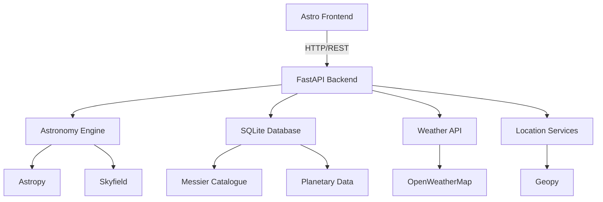
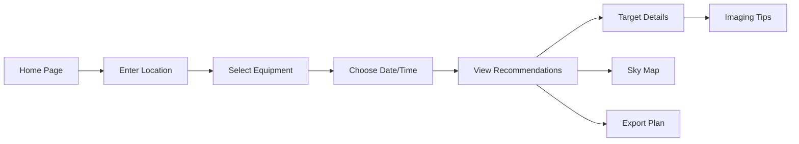

# Astrophotography Target Suggestion Engine - Project Plan

## Executive Summary

This project will create a beginner-friendly astrophotography target suggestion engine using **Astro** for the frontend and **Python FastAPI** for the backend. The system will help users identify optimal celestial targets from the Messier Catalogue based on their location, equipment, and current sky conditions.

## Technology Stack

### Frontend: Astro + TypeScript ⭐
- **Astro**: Modern static site generator with excellent performance
- **TypeScript**: Type-safe JavaScript
- **React/Preact**: For interactive components (sky map, charts)
- **Tailwind CSS**: Utility-first styling
- **Chart.js/D3.js**: Data visualizations
- **Leaflet/Plotly**: Interactive sky maps

### Backend: Python FastAPI
- **FastAPI**: Modern, fast Python web framework
- **Astropy**: Astronomical calculations
- **Skyfield**: High-precision ephemeris
- **SQLite**: Messier Catalogue database
- **Pydantic**: Data validation
- **CORS middleware**: Enable frontend-backend communication

### APIs & Services
- **OpenWeatherMap API**: Weather data
- **Geopy**: Location geocoding

## System Architecture



## REST API Design

### Base URL
```
http://localhost:8000/api/v1
```

### Endpoints

#### 1. Location Services
```
GET /location/geocode?address={address}
Response: {
  "latitude": 51.5074,
  "longitude": -0.1278,
  "timezone": "Europe/London",
  "elevation": 11
}
```

#### 2. Target Calculations
```
POST /targets/calculate
Request: {
  "location": {
    "latitude": 51.5074,
    "longitude": -0.1278,
    "timezone": "Europe/London"
  },
  "equipment": {
    "aperture_mm": 200,
    "focal_length_mm": 1000,
    "sensor_width_mm": 23.5,
    "sensor_height_mm": 15.6
  },
  "observation": {
    "date": "2026-05-01",
    "start_time": "21:00",
    "duration_hours": 4
  },
  "preferences": {
    "min_altitude": 30,
    "moon_avoidance_deg": 30,
    "include_planets": true
  }
}

Response: {
  "targets": [
    {
      "id": "M31",
      "name": "Andromeda Galaxy",
      "type": "galaxy",
      "score": 95,
      "visibility": {
        "peak_time": "23:30",
        "peak_altitude": 65,
        "duration_hours": 3.5
      },
      "moon_separation": 85,
      "weather_score": 80,
      "equipment_match": "excellent"
    }
  ],
  "moon": {
    "phase": "waxing_gibbous",
    "illumination": 0.73,
    "rise_time": "18:45",
    "set_time": "04:30"
  }
}
```

#### 3. Moon Data
```
GET /moon?date={date}&latitude={lat}&longitude={lon}
Response: {
  "phase": "waxing_gibbous",
  "illumination": 0.73,
  "rise_time": "18:45",
  "set_time": "04:30",
  "altitude": 45,
  "azimuth": 180
}
```

#### 4. Weather Data
```
GET /weather?latitude={lat}&longitude={lon}
Response: {
  "cloud_cover": 20,
  "seeing": "good",
  "temperature": 15,
  "humidity": 65,
  "wind_speed": 10,
  "forecast": [...]
}
```

#### 5. Messier Catalogue
```
GET /catalogue/messier
Response: {
  "objects": [
    {
      "id": "M31",
      "name": "Andromeda Galaxy",
      "type": "galaxy",
      "ra": 0.712,
      "dec": 41.269,
      "magnitude": 3.4,
      "size_arcmin": 178,
      "constellation": "Andromeda",
      "best_months": ["Sep", "Oct", "Nov", "Dec"],
      "description": "Nearest major galaxy to Milky Way"
    }
  ]
}

GET /catalogue/messier/{id}
Response: { ... single object details ... }
```

## Project Structure

```
astrophotography-engine/
├── frontend/                       # Astro frontend
│   ├── src/
│   │   ├── components/
│   │   │   ├── LocationInput.astro
│   │   │   ├── EquipmentForm.astro
│   │   │   ├── TargetCard.astro
│   │   │   ├── SkyMap.tsx         # React component
│   │   │   ├── VisibilityChart.tsx
│   │   │   └── MoonPhase.astro
│   │   ├── layouts/
│   │   │   └── Layout.astro
│   │   ├── pages/
│   │   │   ├── index.astro        # Home page
│   │   │   ├── results.astro      # Results page
│   │   │   └── about.astro
│   │   ├── lib/
│   │   │   ├── api.ts             # API client
│   │   │   └── types.ts           # TypeScript types
│   │   └── styles/
│   │       └── global.css
│   ├── public/
│   ├── astro.config.mjs
│   ├── package.json
│   └── tsconfig.json
│
├── backend/                        # Python FastAPI backend
│   ├── app/
│   │   ├── __init__.py
│   │   ├── main.py                # FastAPI app
│   │   ├── api/
│   │   │   ├── __init__.py
│   │   │   ├── targets.py         # Target endpoints
│   │   │   ├── location.py        # Location endpoints
│   │   │   ├── moon.py            # Moon endpoints
│   │   │   ├── weather.py         # Weather endpoints
│   │   │   ├── catalogue.py       # Catalogue endpoints
│   │   │   └── planets.py         # Planet endpoints
│   │   ├── core/
│   │   │   ├── __init__.py
│   │   │   ├── config.py          # Configuration
│   │   │   └── calculations.py    # Astronomy calculations
│   │   ├── models/
│   │   │   ├── __init__.py
│   │   │   ├── request.py         # Request models
│   │   │   └── response.py        # Response models
│   │   ├── database/
│   │   │   ├── __init__.py
│   │   │   ├── messier.db         # SQLite database
│   │   │   └── queries.py         # Database queries
│   │   └── services/
│   │       ├── __init__.py
│   │       ├── visibility.py      # Visibility calculations
│   │       ├── ranking.py         # Target ranking
│   │       └── weather_client.py  # Weather API client
│   ├── requirements.txt
│   └── README.md
│
├── docs/
│   ├── API.md                      # API documentation
│   ├── USER_GUIDE.md               # User guide
│   └── SETUP.md                    # Setup instructions
│
└── README.md
```

## Messier Catalogue Database Schema

```sql
CREATE TABLE messier_objects (
    id TEXT PRIMARY KEY,              -- M1, M31, etc.
    messier_number INTEGER,           -- 1, 31, etc.
    ngc_id TEXT,                      -- NGC number if applicable
    name TEXT,                        -- Common name
    type TEXT,                        -- galaxy, nebula, cluster, etc.
    ra_hours REAL,                    -- Right Ascension (hours)
    dec_degrees REAL,                 -- Declination (degrees)
    magnitude REAL,                   -- Visual magnitude
    size_arcmin REAL,                 -- Angular size (arcminutes)
    constellation TEXT,               -- Constellation
    best_months TEXT,                 -- JSON: ["Sep", "Oct", "Nov"]
    min_aperture_mm INTEGER,          -- Minimum recommended aperture
    difficulty TEXT,                  -- easy, moderate, challenging
    description TEXT,                 -- Description for beginners
    imaging_notes TEXT,               -- Tips for astrophotography
    distance_ly REAL,                 -- Distance in light years
    created_at TIMESTAMP DEFAULT CURRENT_TIMESTAMP
);
```

## Key Features for Beginners

### 1. Simple Location Input
- City/address search (no need to know coordinates)
- Auto-detect timezone
- Visual map confirmation


### 2. Equipment Wizard
- Common telescope/lens presets (Celestron, Meade, etc.)
- Camera presets (Canon, Nikon, ZWO, etc.)
- Simple explanations for each field
- Field of view calculator with visual preview

### 3. Beginner-Friendly Target Scoring
**Scoring Factors:**
- **Visibility** (40%): How high in the sky
- **Brightness** (25%): Easier to image
- **Size** (15%): Fits in field of view
- **Moon Impact** (10%): Moon interference
- **Weather** (10%): Cloud cover

**Difficulty Ratings:**
- 🟢 Easy: Bright, large objects (M31, M42, M45)
- 🟡 Moderate: Medium brightness/size
- 🔴 Challenging: Faint or small objects


## User Interface Flow



## Astro Frontend Pages

### 1. Home Page [`index.astro`](frontend/src/pages/index.astro)
```astro
---
import Layout from '../layouts/Layout.astro';
import LocationInput from '../components/LocationInput.astro';
import EquipmentForm from '../components/EquipmentForm.astro';
---

<Layout title="Astrophotography Target Finder">
  <main>
    <h1>Find Your Perfect Astrophotography Target</h1>
    <p>Discover what to image tonight based on your location and equipment</p>
    
    <LocationInput />
    <EquipmentForm />
    
    <button id="find-targets">Find Targets</button>
  </main>
</Layout>

<script>
  import { calculateTargets } from '../lib/api';
  
  document.getElementById('find-targets')?.addEventListener('click', async () => {
    const data = collectFormData();
    const results = await calculateTargets(data);
    window.location.href = `/results?data=${encodeURIComponent(JSON.stringify(results))}`;
  });
</script>
```

### 2. Results Page [`results.astro`](frontend/src/pages/results.astro)
```astro
---
import Layout from '../layouts/Layout.astro';
import TargetCard from '../components/TargetCard.astro';
import SkyMap from '../components/SkyMap';
import MoonPhase from '../components/MoonPhase.astro';
---

<Layout title="Target Recommendations">
  <main>
    <h1>Recommended Targets for Tonight</h1>
    
    <div class="grid">
      <section class="targets">
        <h2>Top Targets</h2>
        {targets.map(target => <TargetCard target={target} />)}
      </section>
      
      <aside class="info">
        <MoonPhase data={moonData} />
        <SkyMap targets={targets} location={location} client:load />
      </aside>
    </div>
  </main>
</Layout>
```

## Python Backend Core

### FastAPI Main App [`main.py`](backend/app/main.py)
```python
from fastapi import FastAPI
from fastapi.middleware.cors import CORSMiddleware
from app.api import targets, location, moon, weather, catalogue, planets

app = FastAPI(
    title="Astrophotography Target API",
    description="API for calculating optimal astrophotography targets",
    version="1.0.0"
)

# CORS configuration for Astro frontend
app.add_middleware(
    CORSMiddleware,
    allow_origins=["http://localhost:4321"],  # Astro dev server
    allow_credentials=True,
    allow_methods=["*"],
    allow_headers=["*"],
)

# Include routers
app.include_router(targets.router, prefix="/api/v1/targets", tags=["targets"])
app.include_router(location.router, prefix="/api/v1/location", tags=["location"])
app.include_router(moon.router, prefix="/api/v1/moon", tags=["moon"])
app.include_router(weather.router, prefix="/api/v1/weather", tags=["weather"])
app.include_router(catalogue.router, prefix="/api/v1/catalogue", tags=["catalogue"])
app.include_router(planets.router, prefix="/api/v1/planets", tags=["planets"])

@app.get("/")
def read_root():
    return {"message": "Astrophotography Target API", "version": "1.0.0"}
```

### Visibility Calculations [`visibility.py`](backend/app/services/visibility.py)
```python
from astropy.coordinates import SkyCoord, EarthLocation, AltAz, get_sun, get_moon
from astropy.time import Time
import astropy.units as u
from datetime import datetime, timedelta

def calculate_target_visibility(target, location, observation_time, duration_hours=4):
    """Calculate visibility window for a target"""
    
    # Create observer location
    observer = EarthLocation(
        lat=location['latitude'] * u.deg,
        lon=location['longitude'] * u.deg,
        height=location.get('elevation', 0) * u.m
    )
    
    # Target coordinates
    target_coord = SkyCoord(
        ra=target['ra_hours'] * u.hourangle,
        dec=target['dec_degrees'] * u.deg
    )
    
    # Calculate visibility over time window
    visibility_data = []
    current_time = observation_time
    end_time = current_time + timedelta(hours=duration_hours)
    
    while current_time < end_time:
        time_astropy = Time(current_time)
        altaz_frame = AltAz(obstime=time_astropy, location=observer)
        target_altaz = target_coord.transform_to(altaz_frame)
        
        visibility_data.append({
            'time': current_time.isoformat(),
            'altitude': float(target_altaz.alt.deg),
            'azimuth': float(target_altaz.az.deg)
        })
        
        current_time += timedelta(minutes=15)
    
    # Find peak altitude
    peak = max(visibility_data, key=lambda x: x['altitude'])
    
    return {
        'peak_time': peak['time'],
        'peak_altitude': peak['altitude'],
        'visibility_data': visibility_data
    }

def calculate_moon_separation(target, location, observation_time):
    """Calculate angular separation between target and moon"""
    observer = EarthLocation(
        lat=location['latitude'] * u.deg,
        lon=location['longitude'] * u.deg
    )
    
    time_astropy = Time(observation_time)
    
    target_coord = SkyCoord(
        ra=target['ra_hours'] * u.hourangle,
        dec=target['dec_degrees'] * u.deg
    )
    
    moon_coord = get_moon(time_astropy, location=observer)
    separation = target_coord.separation(moon_coord)
    
    return float(separation.deg)
```

### Target Ranking [`ranking.py`](backend/app/services/ranking.py)
```python
def calculate_target_score(target, visibility, moon_separation, weather, equipment):
    """Calculate overall score for a target (0-100)"""
    
    # Visibility score (40%)
    altitude_score = min(visibility['peak_altitude'] / 90 * 100, 100)
    visibility_score = altitude_score * 0.4
    
    # Brightness score (25%)
    # Lower magnitude = brighter = better
    magnitude = target['magnitude']
    brightness_score = max(0, (10 - magnitude) / 10 * 100) * 0.25
    
    # Size score (15%)
    # Check if target fits in field of view
    fov = calculate_field_of_view(equipment)
    size_match = min(target['size_arcmin'] / fov * 100, 100)
    size_score = size_match * 0.15
    
    # Moon impact score (10%)
    moon_score = min(moon_separation / 90 * 100, 100) * 0.1
    
    # Weather score (10%)
    weather_score = (100 - weather['cloud_cover']) * 0.1
    
    total_score = (
        visibility_score +
        brightness_score +
        size_score +
        moon_score +
        weather_score
    )
    
    return round(total_score, 1)

def determine_difficulty(target):
    """Determine difficulty level for beginners"""
    magnitude = target['magnitude']
    size = target['size_arcmin']
    
    if magnitude < 6 and size > 30:
        return 'easy'
    elif magnitude < 9 and size > 10:
        return 'moderate'
    else:
        return 'challenging'
```

## Development Setup

### Frontend Setup
```bash
cd frontend
npm create astro@latest
npm install
npm install -D tailwindcss
npm install chart.js react-chartjs-2
npm install leaflet react-leaflet
npm run dev  # Starts on http://localhost:4321
```

### Backend Setup
```bash
cd backend
python -m venv venv
source venv/bin/activate  # On Windows: venv\Scripts\activate
pip install fastapi uvicorn astropy skyfield geopy requests pydantic
pip install python-multipart
uvicorn app.main:app --reload  # Starts on http://localhost:8000
```

## Deployment Options

### Frontend (Astro)
- **Vercel**: Zero-config deployment
- **Netlify**: Easy static hosting
- **GitHub Pages**: Free hosting
- **Cloudflare Pages**: Fast global CDN

### Backend (FastAPI)
- **Railway**: Simple Python deployment
- **Render**: Free tier available
- **Fly.io**: Global deployment
- **DigitalOcean App Platform**: Managed hosting

## Sample Messier Objects (Top 10 for Beginners)

1. **M31** - Andromeda Galaxy (Easy, Large, Bright)
2. **M42** - Orion Nebula (Easy, Bright, Colorful)
3. **M45** - Pleiades (Easy, Large, Beautiful)
4. **M13** - Hercules Globular Cluster (Moderate, Dense)
5. **M27** - Dumbbell Nebula (Moderate, Planetary Nebula)
6. **M51** - Whirlpool Galaxy (Moderate, Spiral Structure)
7. **M57** - Ring Nebula (Moderate, Small but Bright)
8. **M81** - Bode's Galaxy (Moderate, Spiral)
9. **M104** - Sombrero Galaxy (Challenging, Edge-on)
10. **M1** - Crab Nebula (Challenging, Supernova Remnant)

## Next Steps

1. **Review this updated plan** - Does this align with your Astro experience?
2. **Set up project structure** - Create frontend and backend directories
3. **Build Messier database** - Populate SQLite with 110 objects
4. **Develop API endpoints** - Start with location and catalogue endpoints
5. **Create Astro components** - Build location input and equipment forms
6. **Integrate calculations** - Connect frontend to backend API
7. **Add visualizations** - Sky map and visibility charts
8. **Test and refine** - Ensure beginner-friendly experience

Ready to start building with Astro and Python?