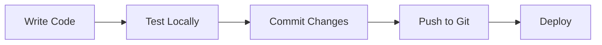

# ⚡ Quick Start Guide

Get your development environment running in 5 minutes!

## 🎯 Immediate Next Steps

### 1️⃣ Create Project Structure (2 minutes)

```bash
# From your current directory
mkdir astrophotography-engine
cd astrophotography-engine
mkdir frontend backend docs

# Initialize git
git init
cat > .gitignore << EOF
node_modules/
venv/
__pycache__/
*.pyc
.env
*.db
.DS_Store
EOF
```

### 2️⃣ Set Up Backend (3 minutes)

```bash
cd backend

# Create virtual environment
python3 -m venv venv
source venv/bin/activate  # On Windows: venv\Scripts\activate

# Create requirements.txt
cat > requirements.txt << EOF
fastapi==0.104.1
uvicorn[standard]==0.24.0
astropy==5.3.4
skyfield==1.46
geopy==2.4.0
requests==2.31.0
pydantic==2.5.0
python-multipart==0.0.6
python-dotenv==1.0.0
EOF

# Install dependencies
pip install -r requirements.txt

# Create directory structure
mkdir -p app/api app/core app/models app/database app/services
touch app/__init__.py app/api/__init__.py app/core/__init__.py
touch app/models/__init__.py app/database/__init__.py app/services/__init__.py
```

### 3️⃣ Set Up Frontend (3 minutes)

```bash
cd ../frontend

# Create Astro project
npm create astro@latest . -- --template minimal --typescript strict --install

# Install dependencies
npm install -D tailwindcss @astrojs/tailwind @astrojs/react
npm install react react-dom chart.js react-chartjs-2 leaflet react-leaflet @types/leaflet

# Initialize Tailwind
npx tailwindcss init
```

### 4️⃣ Copy Starter Files

Copy the code from [`DEVELOPMENT_KICKOFF.md`](DEVELOPMENT_KICKOFF.md) for:

**Backend:**
- `app/main.py` - FastAPI application
- `app/database/init_db.py` - Database initialization
- `app/api/catalogue.py` - Catalogue endpoints
- `app/models/request.py` - Request models
- `app/models/response.py` - Response models

**Frontend:**
- `astro.config.mjs` - Astro configuration
- `tailwind.config.cjs` - Tailwind configuration
- `src/styles/global.css` - Global styles
- `src/layouts/Layout.astro` - Base layout
- `src/lib/api.ts` - API client
- `src/pages/index.astro` - Home page

### 5️⃣ Initialize Database

```bash
cd backend
source venv/bin/activate
cd app/database
python init_db.py
cd ../..
```

### 6️⃣ Start Development Servers

**Terminal 1 - Backend:**
```bash
cd backend
source venv/bin/activate
uvicorn app.main:app --reload
```

**Terminal 2 - Frontend:**
```bash
cd frontend
npm run dev
```

## ✅ Verify Setup

1. **Backend API Docs:** http://localhost:8000/docs
2. **Frontend:** http://localhost:4321
3. **Test API:** http://localhost:8000/api/v1/catalogue/messier

You should see:
- ✅ FastAPI interactive documentation
- ✅ Astro frontend displaying Messier objects
- ✅ No CORS errors in browser console

## 🚀 What's Next?

Once your environment is running, you can:

1. **Explore the API** - Visit http://localhost:8000/docs
2. **Browse the catalogue** - Check out the frontend at http://localhost:4321
3. **Start implementing features** - Follow the todo list in the plan

## 📋 Development Workflow



### Typical Development Cycle:

1. **Backend changes:**
   - Edit files in `backend/app/`
   - FastAPI auto-reloads
   - Test at http://localhost:8000/docs

2. **Frontend changes:**
   - Edit files in `frontend/src/`
   - Astro auto-reloads
   - View at http://localhost:4321

3. **Database changes:**
   - Update `init_db.py`
   - Delete `messier.db`
   - Run `python init_db.py` again

## 🔧 Common Commands

### Backend
```bash
# Activate virtual environment
source venv/bin/activate  # macOS/Linux
venv\Scripts\activate     # Windows

# Start server
uvicorn app.main:app --reload

# Install new package
pip install package-name
pip freeze > requirements.txt

# Run database script
python app/database/init_db.py
```

### Frontend
```bash
# Start dev server
npm run dev

# Build for production
npm run build

# Preview production build
npm run preview

# Install new package
npm install package-name
```

## 🐛 Quick Troubleshooting

| Problem | Solution |
|---------|----------|
| Backend won't start | Check virtual environment is activated |
| Frontend shows API error | Verify backend is running on port 8000 |
| CORS error | Check `allow_origins` in `app/main.py` |
| Database not found | Run `python app/database/init_db.py` |
| Module not found | Run `pip install -r requirements.txt` or `npm install` |

## 📚 Key Files Reference

### Backend Structure
```
backend/
├── app/
│   ├── main.py              # FastAPI app entry point
│   ├── api/
│   │   └── catalogue.py     # Catalogue endpoints
│   ├── models/
│   │   ├── request.py       # Request schemas
│   │   └── response.py      # Response schemas
│   └── database/
│       ├── init_db.py       # Database setup
│       └── messier.db       # SQLite database
└── requirements.txt         # Python dependencies
```

### Frontend Structure
```
frontend/
├── src/
│   ├── pages/
│   │   └── index.astro      # Home page
│   ├── layouts/
│   │   └── Layout.astro     # Base layout
│   ├── lib/
│   │   └── api.ts           # API client
│   └── styles/
│       └── global.css       # Global styles
├── astro.config.mjs         # Astro config
└── package.json             # Node dependencies
```

## 🎯 Success Checklist

Before moving to the next phase, ensure:

- [ ] Both servers start without errors
- [ ] Frontend displays data from backend
- [ ] API documentation is accessible
- [ ] Database contains sample objects
- [ ] No console errors in browser
- [ ] Git repository is initialized
- [ ] `.gitignore` is configured

## 💡 Pro Tips

1. **Keep both terminals visible** - Use split panes to monitor both servers
2. **Use the API docs** - FastAPI's `/docs` endpoint is your best friend
3. **Check browser console** - Catch frontend errors early
4. **Commit often** - Small, frequent commits are easier to debug
5. **Read error messages** - They usually tell you exactly what's wrong

---

**Need more details?** Check [`DEVELOPMENT_KICKOFF.md`](DEVELOPMENT_KICKOFF.md) for comprehensive instructions.

**Ready to code?** Follow the steps above and you'll be developing in minutes! 🚀